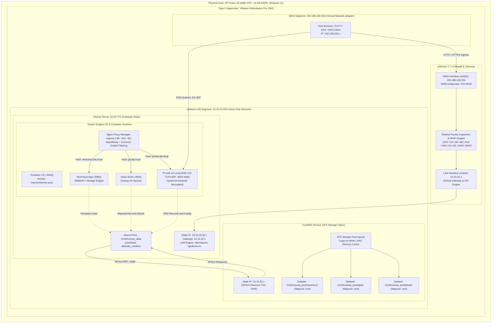

# Virtualized Enterprise Network Infrastructure Design

[](#)
[](#)
[-007CB6?style=flat-square&logo=truenas&logoColor=white)](#)
[](#)
[](#)
[](#)
[](#)

A single-host virtualized homelab built under strict hardware constraints (16 GB RAM) to reproduce and study enterprise-inspired infrastructure patterns. The project combines **Multi-tier Virtualization**, **Network Perimeter Security & Segmentation**, **Decoupled ZFS Network Storage**, **Containerized Services**, **Layer 7 Ingress Traffic Consolidation**, and **Centralized Local DNS**.

> **Project scope:** This repository documents a learning-focused homelab, not a production deployment. The design intentionally mirrors selected enterprise infrastructure patterns on a single workstation.

---

## 📑 Table of Contents
- [1. Engineering Motivation & Problem Statement](#1-engineering-motivation--problem-statement)
- [2. System Architecture & Topology](#2-system-architecture--topology)
- [3. Hardware & Resource Budgeting](#3-hardware--resource-budgeting)
- [4. Network Segmentation & Firewall Routing (pfSense)](#4-network-segmentation--firewall-routing-pfsense)
- [5. Centralized Storage Fabric (TrueNAS SCALE & ZFS)](#5-centralized-storage-fabric-truenas-scale--zfs)
- [6. Compute Node & System Hardening (Ubuntu Server)](#6-compute-node--system-hardening-ubuntu-server)
- [7. Container Orchestration & Microservices](#7-container-orchestration--microservices)
- [8. Layer 7 Ingress & Name Resolution (NPM & Pi-hole)](#8-layer-7-ingress--name-resolution-npm--pi-hole)
- [9. End-to-End Request Lifecycle](#9-end-to-end-request-lifecycle)
- [10. Troubleshooting & Incident Response Archive](#10-troubleshooting--incident-response-archive)
- [11. Verification Matrix](#11-verification-matrix)
- [12. Deterministic Boot Sequence](#12-deterministic-boot-sequence)
- [13. Recommended Repository File Structure](#13-recommended-repository-file-structure)

---

## 1. Engineering Motivation & Problem Statement

Traditional bare-metal deployments can suffer from hardware underutilization, higher operational overhead, and tight coupling between compute runtime and user data. Those characteristics can make maintenance, recovery, and service migration more difficult when hardware or operating-system failures occur.

This project explores those challenges through an enterprise-inspired virtualized homelab that emphasizes:
1. **Decoupling of Compute & Storage:** Application runtimes execute on Ubuntu while persistent application data, repositories, and configuration directories are stored on an independent TrueNAS SCALE node via NFSv4. This reduces dependence on the Ubuntu VM's local disk.
2. **Strict Perimeter Isolation (RFC 1918):** Internal servers exist on an isolated, non-routable private subnet (`10.10.20.0/24`) behind a dual-homed pfSense stateful firewall with explicit "Default-Deny" ingress rules.
3. **Ingress & Service Consolidation:** Nginx Proxy Manager centralizes Layer 7 HTTP routing, while Pi-hole centralizes local DNS records so clients can use service names instead of memorizing backend ports.

---

## 2. System Architecture & Topology



---

## 3. Hardware & Resource Budgeting

Operating this multi-service homelab within a 16 GB physical RAM envelope required careful resource allocation to reduce the risk of memory pressure, excessive paging, and host instability:

| Node / Virtual Machine | Role | vCPU | Allocated RAM | Storage / Disk | Operating System / Engine |
| :--- | :--- | :---: | :---: | :--- | :--- |
| **Physical Host** | Bare-Metal Platform | 8C / 16T | ~5.0 - 6.0 GB Free | 512 GB NVMe SSD | Windows 11 + VMware Workstation Pro 25H2 |
| **pfSense** | Router / Firewall / NAT | 1 vCPU | 1.0 GB (1024 MB) | 8 GB Virtual Disk | FreeBSD-based pfSense 2.7.x |
| **TrueNAS SCALE** | Storage Controller (ZFS) | 2 vCPU | 4.0 GB (4096 MB) | Dedicated Virtual Disk Pool | Debian-based TrueNAS SCALE (OpenZFS) |
| **Ubuntu Server** | Compute Node (Docker Host)| 2 vCPU | 4.0 GB (4096 MB) | 50 GB LVM Thin Provisioned | Ubuntu Server 24.04 LTS (Headless) |
| **ESXi-1 (Nested)** | Type-1 Hypervisor Node | 2 vCPU | Lab Standby Pool | Dynamic Provisioning | VMware ESXi 8.0 (Nested Virtualization) |

### Hardware Virtualization Passthrough
To enable nested Type-1 hypervisor execution (ESXi) on AMD hardware without host-level instruction traps, hardware-enforced virtualization flags were configured:
* `vhv.enable = "TRUE"` injected into the `.vmx` configuration file to expose hardware virtualization flags directly to the guest OS.
* `hypervisor.cpuid.v0 = "FALSE"` to bypass guest hypervisor detection mechanisms.

---

## 4. Network Segmentation & Firewall Routing (pfSense)

The network perimeter is segmented into two non-overlapping logical zones:
* **WAN Interface (`vtnet0`):** Bridged/Host-side VMnet segment (`192.168.100.250/24`). Acts as the ingress boundary exposed to the host machine.
* **LAN Interface (`vtnet1`):** Isolated Host-Only VMnet segment (`10.10.20.1/24`). Hosts internal compute and storage instances without direct external reachability.

### DNAT / Port Forwarding Matrix
To allow administrative access and ingress routing from the host without exposing internal server interfaces directly, the following Destination NAT rules were deployed on pfSense WAN (`192.168.100.250`):

| External Port (WAN) | Internal Target IP | Internal Port | Protocol | Target Service Description |
| :--- | :--- | :--- | :--- | :--- |
| **TCP 2222** | `10.10.20.50` | `22` | TCP | Secure Shell (SSH) access to Ubuntu Server |
| **TCP 80** | `10.10.20.50` | `80` | TCP | Nginx Proxy Manager HTTP ingress router |
| **TCP 443** | `10.10.20.50` | `443` | TCP | Nginx Proxy Manager HTTPS ingress router |
| **TCP 81** | `10.10.20.50` | `81` | TCP | Nginx Proxy Manager Web Admin dashboard |
| **TCP 9443** | `10.10.20.50` | `9443` | TCP | Portainer Community Edition Web Console |

### Firewall Hardening & Rule Policies
* **Default-Deny Ingress:** All unsolicited inbound traffic on the WAN interface is dropped by default unless explicitly permitted by stateful NAT rules.
* **RFC 1918 Deconfliction:** `Block private networks` and `Block bogon networks` were unchecked on the WAN interface to allow communication with the hypervisor host.
* **Management Port Isolation:** pfSense WebConfigurator was reassigned from `443/TCP` to `8443/TCP` (`https://192.168.100.250:8443`), reserving standard port 443 for public HTTPS ingress.

---

## 5. Centralized Storage Fabric (TrueNAS SCALE & ZFS)

Storage resilience and state management are decoupled from the compute instance using OpenZFS running on TrueNAS SCALE:
* **Storage Pool (`zpool`):** Uses OpenZFS Copy-on-Write (CoW) and checksumming semantics to improve data integrity and reduce the risk of silent corruption; transactional updates also help preserve filesystem consistency after interrupted writes.
* **Granular Dataset Isolation:** Dedicated datasets configured with native `lz4` compression for `/nextcloud`, `/gitea`, and `/pihole`.
* **NFSv4 Export Architecture:** Shares are exported strictly across the internal LAN segment (`10.10.20.0/24`) using NFSv4 daemons (TCP port 2049).
* **Maproot Security Configuration:** TrueNAS exports explicitly define `Maproot User: root` and `Maproot Group: root` to prevent container UID squash failures during POSIX file operations.

### Persistent Network Mount (`/etc/fstab`)
On the Ubuntu compute node, the remote storage fabric is mounted locally at `/mnt/truenas_data`. The `_netdev` option marks the mount as network-dependent, helping systemd order it after network availability and reducing boot-time mount failures:

```text
# /etc/fstab entry on Ubuntu Server
10.10.20.x:/mnt/truenas_pool/data  /mnt/truenas_data  nfs  defaults,_netdev  0  0
```

---

## 6. Compute Node & System Hardening (Ubuntu Server)

The compute instance runs minimal headless Ubuntu Server 24.04 LTS configured with declarative static networking:

```yaml
# /etc/netplan/50-cloud-init.yaml
network:
  version: 2
  ethernets:
    ens33:
      dhcp4: no
      addresses:
        - 10.10.20.50/24
      routes:
        - to: default
          via: 10.10.20.1
      nameservers:
        addresses: [10.10.20.1, 8.8.8.8]
```

### Dynamic Logical Volume Management (LVM) Expansion
To remediate disk exhaustion (`no space left on device`) caused by default installer partitioning during Docker layer caching, the LVM partition and ext4 filesystem were dynamically extended online without rebooting:
```bash
# Expand logical volume across all free volume group space
sudo lvextend -l +100%FREE /dev/ubuntu-vg/ubuntu-lv

# Online resize of ext4 filesystem structures
sudo resize2fs /dev/mapper/ubuntu--vg-ubuntu--lv
```

### Decoupling Linux Stub Resolver (Port 53 Freeing)
Ubuntu's default `systemd-resolved` stub resolver (`127.0.0.53:53`) was decoupled to permit Docker to bind the host's port 53 directly to the Pi-hole DNS container:
```bash
# Set DNSStubListener=no in /etc/systemd/resolved.conf
sudo sed -r -i.orig 's/#?DNSStubListener=yes/DNSStubListener=no/g' /etc/systemd/resolved.conf

# Reload systemd resolver daemon
sudo systemctl restart systemd-resolved

# Confirm port 53 socket is completely released
sudo lsof -i :53
```

### Ingress SSH & Gateway Connectivity Verification
Network convergence, default gateway reachability via pfSense (`10.10.20.1`), and remote administrative SSH access via pfSense WAN DNAT (`192.168.100.250:2222` -> `10.10.20.50:22`) were verified from the host workstation:
```bash
# Verify active default routing table
ip route show default

# Verify link reachability across the isolated LAN segment
ping -c 3 10.10.20.1
```

---

## 7. Container Orchestration & Microservices

Docker Engine CE operates as the container runtime on the Ubuntu compute node and is managed through Portainer CE via the host UNIX socket (`/var/run/docker.sock`). Containers use Linux namespaces and cgroups for process, network, and mount isolation while still sharing the Ubuntu host kernel.

### Declarative Infrastructure as Code (`docker-compose.yml`)

> **Security note:** Never commit real passwords, API keys, tokens, or private certificates. The example below uses an environment-variable placeholder for the Pi-hole password; keep the real value in a local `.env` file that is excluded by `.gitignore`.
Persistent application data directories are bound to the local TrueNAS-backed NFS mount (`/mnt/truenas_data`), keeping application data outside the Ubuntu VM's local root filesystem:

```yaml
version: "3"

services:
  # Ingress Reverse Proxy
  nginx-proxy-manager:
    image: 'jc21/nginx-proxy-manager:latest'
    container_name: nginx-proxy-manager
    restart: unless-stopped
    ports:
      - '80:80'     # HTTP Ingress
      - '81:81'     # Management Web Console
      - '443:443'   # HTTPS Ingress
    volumes:
      - /mnt/truenas_data/npm/data:/data
      - /mnt/truenas_data/npm/letsencrypt:/etc/letsencrypt

  # Centralized Local DNS & Telemetry Sinkhole
  pihole:
    image: pihole/pihole:latest
    container_name: pihole
    restart: unless-stopped
    ports:
      - "53:53/tcp"
      - "53:53/udp"
      - "8053:80/tcp" # Web UI remapped to 8053 to eliminate host Port 80 binding conflicts
    environment:
      TZ: 'Europe/Istanbul'
      WEBPASSWORD: '${PIHOLE_WEBPASSWORD}' # Define locally in .env; never commit real credentials
    volumes:
      - /mnt/truenas_data/pihole/etc-pihole:/etc/pihole
      - /mnt/truenas_data/pihole/etc-dnsmasq.d:/etc/dnsmasq.d

  # Enterprise Content Collaboration & Cloud Storage
  nextcloud:
    image: nextcloud:latest
    container_name: nextcloud
    restart: unless-stopped
    ports:
      - "8080:80"   # Exposed to host for NPM reverse proxy forwarding
    volumes:
      - /mnt/truenas_data/nextcloud/data:/var/www/html/data

  # Ultra-lightweight Source Code Management Platform
  gitea:
    image: gitea/gitea:latest
    container_name: gitea
    restart: unless-stopped
    ports:
      - "3000:3000" # HTTP Git clone and Web UI operations
    volumes:
      - /mnt/truenas_data/gitea:/data
```

---

## 8. Layer 7 Ingress & Name Resolution (NPM & Pi-hole)

### Centralized Local DNS Records (Pi-hole v6)
Rather than maintaining separate local `hosts` entries across client machines, internal name resolution is centralized in Pi-hole v6. Local `A` records map the lab service names to the pfSense WAN ingress interface (`192.168.100.250`):

* `nextcloud.lab.local` $\rightarrow$ `192.168.100.250`
* `git.lab.local` $\rightarrow$ `192.168.100.250`
* `pihole.lab.local` $\rightarrow$ `192.168.100.250`

```bash
# Internal custom DNS table inspection (/etc/pihole/custom.list)
192.168.100.250 nextcloud.lab.local
192.168.100.250 git.lab.local
192.168.100.250 pihole.lab.local
```

### Ingress Proxy Host Mapping (Nginx Proxy Manager)
Powered by OpenResty (Nginx integrated with LuaJIT), NPM terminates incoming HTTP connections, evaluates Layer 7 `Host:` request headers, and dynamically dispatches traffic to backend container sockets without requiring port declarations in client browsers:

| Domain Name | Scheme | Forward Target IP | Forward Port | Security Hardening |
| :--- | :---: | :--- | :---: | :--- |
| **`nextcloud.lab.local`** | HTTP | `10.10.20.50` | `8080` | `Block Common Exploits` (SQLi, LFI, RFI filters) |
| **`git.lab.local`** | HTTP | `10.10.20.50` | `3000` | `Block Common Exploits` + Websockets support |
| **`pihole.lab.local`** | HTTP | `10.10.20.50` | `8053` | `Block Common Exploits` enabled |

### Ingress Resilience & State Restoration
NPM maintains dynamic virtual host configurations inside an internal SQLite database (`database.sqlite`). Following storage fault recovery scenarios, virtual host mapping tables are verified and repopulated via the management console (`http://192.168.100.250:81`), preventing `404 Not Found (openresty)` fallback loops.

---

## 9. End-to-End Request Lifecycle

To illustrate the integration across all six architectural tiers, the following sequence details the lifecycle of a client HTTP transaction executing `http://git.lab.local`:

```
[ Client: Windows 11 Workstation ]
               │
               │ 1. DNS A Query (UDP:53) -> "git.lab.local?"
               ▼
[ Tier 4: Pi-hole v6 DNS Container (10.10.20.50:53) ]
               │
               │ 2. Local DNS Response -> "192.168.100.250"
               ▼
[ Client initiates TCP Handshake (SYN) to 192.168.100.250:80 ]
               │
               ▼
[ Tier 1: pfSense Perimeter Firewall (WAN vtnet0: 192.168.100.250) ]
               │ - Stateful Packet Inspection (SPI) permits inbound traffic
               │ - Destination NAT (DNAT): Rewrites Destination to 10.10.20.50:80
               │ - Dispatches packet via LAN interface (vtnet1: 10.10.20.1)
               ▼
[ Tier 3: Ubuntu Server Compute Node (ens33: 10.10.20.50) ]
               │ - Linux Kernel Netfilter/iptables intercepts packet
               │ - Bridges traffic across docker0 to Container IP: 172.x.x.x:80
               ▼
[ Tier 5: Nginx Proxy Manager (OpenResty Ingress Engine) ]
               │ - Layer 7 Termination: Inspects "Host: git.lab.local" header
               │ - NPM common-exploit filtering is enabled before proxy forwarding
               │ - Dispatches reverse proxy request: proxy_pass http://10.10.20.50:3000
               ▼
[ Tier 5: Gitea SCM Microservice (Port 3000) ]
               │ - Processes application logic
               │ - Issues POSIX filesystem read: /data/git/repositories/repo.git
               ▼
[ Host VFS & NFS Client (Ubuntu /mnt/truenas_data/gitea) ]
               │ - nfs.ko Kernel Module serializes RPC call
               │ - Transmits NFSv4 remote request over TCP:2049
               ▼
[ Tier 2: TrueNAS SCALE Enterprise Storage (10.10.20.x:2049) ]
               │ - Validates Maproot (root:root) access permissions
               │ - OpenZFS engine fetches data blocks via ARC / Copy-on-Write vdevs
               ▼
[ Streamed response traverses reverse pipeline to client browser ]
```

---

## 10. Troubleshooting & Incident Response Archive

During the infrastructure engineering lifecycle, 8 critical hardware, kernel, network, and application failures were diagnosed and resolved using formal root-cause analysis:

### Incident 1: AMD-V Virtualization Passthrough Interruption (`hv.capable was 0`)
* **Symptom:** VMware Workstation failed to power on the nested ESXi virtual appliance, terminating with:  
  `Feature 'hv.capable' was 0, but must be at least 0x1. Module 'FeatureCompatLate' power on failed.`
* **Root Cause:** Windows 11 Virtualization-Based Security (VBS) and Hyper-V Memory Integrity intercepted and locked physical AMD-V hardware instruction registers, denying nested hypervisor execution.
* **Remediation:**
  1. Disabled the Windows Hyper-V hypervisor scheduler from an elevated prompt:
     ```cmd
     bcdedit /set hypervisorlaunchtype off
     ```
  2. Disabled Core Isolation / Memory Integrity in Windows Defender Security Center.
  3. Enforced hardware nested virtualization flags directly in `ESXi-1.vmx`:
     ```text
     hypervisor.cpuid.v0 = "FALSE"
     vhv.enable = "TRUE"
     ```

### Incident 2: Compute Node Root Volume Exhaustion (`no space left on device`)
* **Symptom:** Docker image layer caching and container initialization failed with disk write exhaustion errors:  
  `Error response from daemon: write /var/lib/docker/tmp/...: no space left on device`
* **Root Cause:** Ubuntu Subiquity installer provisioned only 20 GB to the root Logical Volume (`/dev/ubuntu-vg/ubuntu-lv`), leaving the remaining storage unallocated in the Volume Group (`ubuntu-vg`).
* **Remediation:** Executed an online LVM logical-volume and ext4 filesystem expansion without rebooting the Ubuntu VM:
  ```bash
  sudo lvextend -l +100%FREE /dev/ubuntu-vg/ubuntu-lv
  sudo resize2fs /dev/mapper/ubuntu--vg-ubuntu--lv
  ```

### Incident 3: NFSv4 UID Squash Failure (`Permission Denied` on Containers)
* **Symptom:** Nextcloud and Gitea containers crashed upon startup, failing to initialize persistent database directories inside `/mnt/truenas_data`.
* **Root Cause:** TrueNAS SCALE NFS server defaulted to strict Root Squashing, converting incoming UID 0 (root) requests from Docker daemons into unprivileged `nobody` (UID 65534) operations.
* **Remediation:** Configured TrueNAS NFS share advanced attributes to map remote root credentials directly to local storage root:
  * `Maproot User:` **root**
  * `Maproot Group:` **root** (or **wheel**)
  * Adjusted mount permissions: `sudo chmod -R 775 /mnt/truenas_data`

### Incident 4: pfSense WAN RFC 1918 / Bogon Ingress Drop
* **Symptom:** Hypervisor host was completely unable to ping or establish HTTP connections to the pfSense WAN IP (`192.168.100.250`).
* **Root Cause:** pfSense classifies the WAN interface as untrusted internet boundary by default, enforcing implicit drop rules against all private address blocks defined in RFC 1918 (`192.168.0.0/16`, `10.0.0.0/8`, `172.16.0.0/12`).
* **Remediation:** Unchecked **Block private networks and loopback addresses** and **Block bogon networks** under **Interfaces > WAN** to permit hypervisor host traffic.

### Incident 5: Socket Contention on Management Ingress (Port 443)
* **Symptom:** Adding an HTTPS DNAT rule on pfSense WAN for Nginx Proxy Manager (`443 -> 10.10.20.50:443`) broke access to the pfSense WebConfigurator interface.
* **Root Cause:** Both the pfSense administrative web daemon (lighttpd/nginx) and the DNAT rule attempted to bind to WAN port 443 simultaneously.
* **Remediation:** Migrated the pfSense WebConfigurator management listener to `8443/TCP` under **System > Advanced > Admin Access**, dedicating port 443 exclusively to reverse proxy traffic.

### Incident 6: Linux Stub Resolver Port Contention (`bind: address already in use: 53`)
* **Symptom:** Docker Engine failed to instantiate the Pi-hole container, throwing driver failure logs:  
  `driver failed programming external connectivity on endpoint pihole: bind: address already in use (0.0.0.0:53)`
* **Root Cause:** Ubuntu's native `systemd-resolved` background service was actively bound to loopback socket `127.0.0.53:53`, blocking host socket allocation.
* **Remediation:** Decoupled the local resolver in `/etc/systemd/resolved.conf` by setting `DNSStubListener=no`, executed `sudo systemctl restart systemd-resolved`, and validated port availability via `sudo lsof -i :53`.

### Incident 7: OpenResty Ingress Virtual Host Null Routing (`404 Not Found`)
* **Symptom:** Navigating to `http://pihole.lab.local/admin` returned an immediate `404 Not Found (openresty)` error.
* **Root Cause:** Host disk saturation had corrupted NPM's internal SQLite database (`database.sqlite`), wiping active virtual host mapping tables and causing OpenResty to drop unmatched requests to its default fallback server.
* **Remediation:** Re-authenticated to the NPM administrative console (`http://192.168.100.250:81`) and re-registered declarative Proxy Host rules targeting internal backend ports.

### Incident 8: Pi-hole v6 FTL Command Deprecation (`Wrong password!`)
* **Symptom:** Web interface rejected administrative login credentials, and legacy container override commands (`pihole -a -p <pwd>`) failed with CLI usage errors.
* **Root Cause:** Pi-hole v6 completely refactored its administrative API into the FTL core, deprecating legacy flags in favor of dedicated FTL CLI tools.
* **Remediation:** Executed the updated administrative reset syntax directly within the container namespace:
  ```bash
  sudo docker exec -it pihole pihole setpassword <NEW_SECURE_PASSWORD>
  ```


---

## 11. Verification Matrix

| Component / Subsystem | Implementation Status | Verification Evidence |
| :--- | :---: | :--- |
| **VMware Workstation Pro 25H2** | **Verified (✅)** | Host hypervisor platform actively virtualizing all guest appliances. |
| **Nested VMware ESXi Instance** | **Verified (✅)** | Virtualized AMD-V hardware flags validated via guest kernel scheduler. |
| **pfSense Dual-Homed Firewall** | **Verified (✅)** | Active WAN (`192.168.100.250`) and isolated LAN (`10.10.20.1`) routing. |
| **DNAT Port Forwarding Matrix** | **Verified (✅)** | Operational ingress translation on ports 2222, 80, 443, 81, and 9443. |
| **TrueNAS SCALE OpenZFS Pool** | **Verified (✅)** | Isolated datasets configured with dedicated ZFS transactional storage. |
| **NFSv4 Decoupled Mounts** | **Verified (✅)** | Mounted on Ubuntu at `/mnt/truenas_data` with `defaults,_netdev` persistence. |
| **Headless Ubuntu Server 24.04** | **Verified (✅)** | Compute node operating with static Netplan network configuration. |
| **Dynamic LVM Volume Expansion** | **Verified (✅)** | Online resize completed without rebooting the Ubuntu VM (`resize2fs`). |
| **Docker Engine & Portainer CE** | **Verified (✅)** | Container lifecycle managed via host socket (`/var/run/docker.sock`). |
| **Nextcloud Cloud Storage** | **Verified (✅)** | Containerized on host port 8080, persisting data to TrueNAS NFS pool. |
| **Gitea SCM Platform** | **Verified (✅)** | Ultra-lightweight Golang Git runtime operating on host port 3000. |
| **Nginx Proxy Manager (OpenResty)** | **Verified (✅)** | Single-entry Layer 7 routing with NPM's `Block Common Exploits` option enabled. |
| **Pi-hole v6 Centralized DNS** | **Verified (✅)** | Network-wide `.lab.local` resolution validated via client `nslookup`. |
| **Client Decoupling (`hosts` clean)** | **Verified (✅)** | Client static `hosts` entries removed; Pi-hole local DNS records handle lab name resolution. |
| **Public TLS/SSL (Let's Encrypt)** | **Not Implemented (❌)** | `.lab.local` is a private TLD; HTTP ingress utilized in development. |
| **Active Directory Integration** | **Architectural Scope (🟡)** | Topology designed for LDAP/AD integration; deferred for future expansion. |

---

## 12. Deterministic Boot Sequence

Because services exhibit strict directed acyclic graph (DAG) dependencies, recovery or startup must follow this deterministic order to prevent socket errors and mounting failures:

1. **Tier 1 (Routing & Perimeter Security):** Power on **pfSense**. Ensures default gateway (`10.10.20.1`), routing engine, and virtual network translation tables are active before internal interfaces request routes.
2. **Tier 2 (Storage Controller):** Power on **TrueNAS SCALE**. Permits OpenZFS storage pools to import, datasets to mount, and the `nfs-kernel-server` RPC daemons to initialize.
3. **Tier 3 (Compute Node):** Power on **Ubuntu Server**. Netplan initializes network interfaces, and the `/etc/fstab` configuration cleanly attaches `/mnt/truenas_data` via `_netdev` before dependent system units load.
4. **Tier 4 (Core Engine & Ingress Foundation):** Docker Engine daemon starts $\rightarrow$ **Pi-hole** binds Port 53 UDP/TCP $\rightarrow$ **Nginx Proxy Manager** binds Ports 80 and 443.
5. **Tier 5 (Application Microservices):** **Nextcloud** and **Gitea** spin up, safely attaching to pre-mounted, persistent TrueNAS NFS directories.

---

## 13. Recommended Repository File Structure

To maintain a professional DevOps/Infrastructure repository, the following directory layout is recommended. Treat it as a **target structure**: add only files that you actually export, reconstruct, or verify from the lab instead of creating placeholder files solely to match the tree.

```text
virtualized-enterprise-network-infrastructure/
├── README.md                           # Master technical documentation (this file)
├── LICENSE                             # Open-source license (MIT / Apache 2.0)
├── .gitignore                          # Excludes VMDKs, ISOs, .env, and local logs
│
├── compose/                            # Infrastructure as Code (Docker Compose)
│   ├── docker-compose.yml              # Unified stack specification (NPM, Pi-hole, Nextcloud, Gitea)
│   └── .env.example                    # Template environment variables (credentials omitted)
│
├── configs/                            # Operational configuration backups
│   ├── netplan/
│   │   └── 50-cloud-init.yaml          # Ubuntu static IP network specification
│   ├── systemd/
│   │   └── resolved.conf               # DNSStubListener=no hardening configuration
│   ├── pihole/
│   │   └── custom.list                 # Local DNS mappings template
│   └── pfsense/
│       └── nat-rules-summary.csv       # Documented port forward rules and mappings
│
├── docs/                               # In-depth architectural reports & academic references
│   ├── architecture-deep-dive.md       # Tiered virtualization and hypervisor passthrough
│   ├── storage-and-zfs-design.md       # ZFS ARC, datasets, and NFSv4 root squashing
│   └── troubleshooting-runbook.md      # Detailed step-by-step resolution logs for incidents
│
└── scripts/                            # Automation & disaster recovery helper scripts
    ├── lvm-online-extend.sh            # One-line script to extend LVM logical volumes
    └── nfs-mount-verify.sh             # Health-check script verifying TrueNAS connectivity
```

