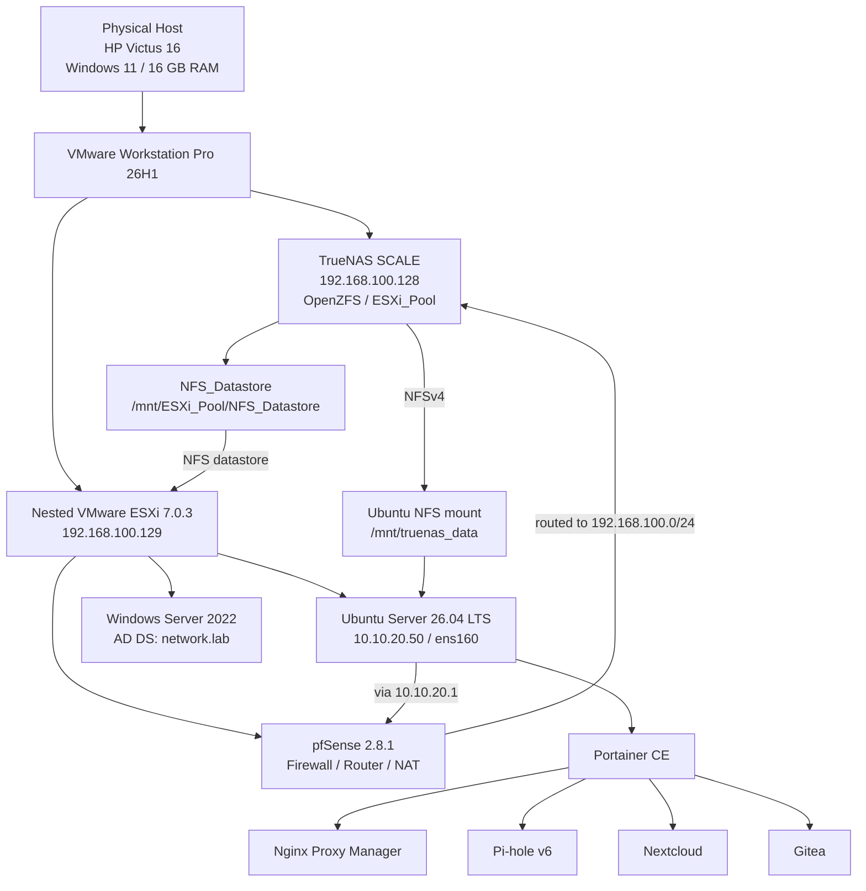

# Virtualized Enterprise Network Infrastructure Design

[](#)
[](#)
[](#)
[](#)
[](#)
[](#)
[](#)
[](#)

A single-host virtualization homelab designed to model and study **enterprise network infrastructure design** under a constrained hardware budget. The final implementation combines nested virtualization, routed network segmentation, centralized OpenZFS-backed network storage, Active Directory Domain Services, containerized application services, reverse-proxy ingress, and centralized local DNS.

> **Scope:** This is a learning-focused homelab, not a production deployment. The project intentionally models selected enterprise infrastructure patterns on one physical workstation and documents both implemented features and design limitations.

---

## Table of Contents

- [1. Project Goals](#1-project-goals)
- [2. Final Architecture](#2-final-architecture)
- [3. Verified Platform Inventory](#3-verified-platform-inventory)
- [4. Network Segmentation and pfSense](#4-network-segmentation-and-pfsense)
- [5. TrueNAS, NFS, and Storage Dependencies](#5-truenas-nfs-and-storage-dependencies)
- [6. Ubuntu Compute Node](#6-ubuntu-compute-node)
- [7. Container Platform and Services](#7-container-platform-and-services)
- [8. Local DNS and Reverse Proxy](#8-local-dns-and-reverse-proxy)
- [9. Active Directory](#9-active-directory)
- [10. End-to-End Traffic Paths](#10-end-to-end-traffic-paths)
- [11. Startup and Shutdown Dependencies](#11-startup-and-shutdown-dependencies)
- [12. Implementation Evidence](#12-implementation-evidence)
- [13. Repository Artifacts and Provenance](#13-repository-artifacts-and-provenance)
- [14. Design Limitations](#14-design-limitations)
- [15. Documentation](#15-documentation)

---

## 1. Project Goals

The project was built around five engineering objectives:

1. **Separate infrastructure roles** instead of placing routing, storage, directory services, and applications on one operating system.
2. **Model routed security zones** using pfSense and multiple isolated VMware/ESXi virtual network segments.
3. **Centralize storage** on TrueNAS SCALE and consume it through NFS from both nested ESXi and Ubuntu.
4. **Consolidate application services** on an Ubuntu Docker host using Portainer-managed Compose stacks.
5. **Centralize naming and ingress** using Pi-hole v6 and Nginx Proxy Manager.

The environment also became a practical troubleshooting lab for nested virtualization, LVM capacity, NFS permissions, host-port conflicts, and reverse-proxy routing.

---

## 2. Final Architecture



The most important architectural dependency is that **TrueNAS supplies the NFS datastore used by nested ESXi**, while the Ubuntu compute VM also mounts the same exported NFS path at `/mnt/truenas_data`.


---

## 3. Verified Platform Inventory

| Component | Verified Final State | Role |
|---|---|---|
| Physical host | HP Victus 16, Windows 11, AMD 8C/16T class CPU, 16 GB RAM | Bare-metal workstation |
| VMware Workstation | **Workstation Pro 26H1** | Type-2 host hypervisor |
| Nested ESXi | **VMware ESXi 7.0.3** | Nested Type-1 hypervisor |
| pfSense | **2.8.1-RELEASE** | Routing, firewalling, NAT, network-zone gateway |
| TrueNAS SCALE | TrueNAS SCALE / OpenZFS | Central storage appliance |
| Ubuntu Server | **26.04 LTS**, interface `ens160` | Docker compute node |
| Windows Server | **Windows Server 2022** | Active Directory Domain Services |
| Docker / Portainer | Docker Engine + Portainer CE | Container runtime and management |
| Nginx Proxy Manager | Running container | HTTP reverse proxy |
| Pi-hole | v6, healthy container | Local DNS |
| Nextcloud | Running container | Collaboration / file application |
| Gitea | Running container | Git service |

### Nested virtualization settings

The ESXi Workstation VM was configured with the documented nested-virtualization flags:

```text
vhv.enable = "TRUE"
hypervisor.cpuid.v0 = "FALSE"
```

These settings are documented as part of the nested-virtualization troubleshooting history; they do not imply that every host-side Windows virtualization setting was preserved as an exact reproducible record.

---

## 4. Network Segmentation and pfSense

The final pfSense VM has six routed interfaces:

| Logical zone / pfSense interface name | Gateway / Interface IP | Role |
|---|---:|---|
| WAN | `192.168.100.250/24` | Host-side / upstream lab network |
| LAN | `10.10.10.1/24` | General internal LAN |
| `VLAN20_SERVERS` | `10.10.20.1/24` | Server segment |
| `VLAN30_DMZ` | `10.10.30.1/24` | DMZ segment |
| `VLAN40_CLIENTS` | `10.10.40.1/24` | Client segment |
| `VLAN99_GUEST` | `10.10.99.1/24` | Guest segment |

> **Terminology note:** The names `VLAN20_*`, `VLAN30_*`, `VLAN40_*`, and `VLAN99_*` are interface/zone labels. The pfSense VLAN table is empty in the verified live environment, so this repository does **not** claim implemented IEEE 802.1Q VLAN tagging. Segmentation is provided by separate virtual NICs / virtual network segments.


### Verified DNAT rules

pfSense WAN (`192.168.100.250`) forwards selected services to the Ubuntu compute node (`10.10.20.50`):

| WAN Port | Target | Purpose |
|---:|---|---|
| `2222/TCP` | `10.10.20.50:22` | Ubuntu SSH |
| `80/TCP` | `10.10.20.50:80` | NPM HTTP ingress |
| `443/TCP` | `10.10.20.50:443` | NPM HTTPS ingress path |
| `81/TCP` | `10.10.20.50:81` | NPM management |
| `9443/TCP` | `10.10.20.50:9443` | Portainer management |


The pfSense WebConfigurator was moved to `8443/TCP` so WAN-side `443/TCP` could remain available for the reverse-proxy ingress path.

Because this lab uses an RFC1918 address on the pfSense WAN side, `Block private networks` was disabled for the lab topology. `Block bogon networks` was also disabled as part of the configured private-WAN setup.

---

## 5. TrueNAS, NFS, and Storage Dependencies

TrueNAS is not merely an application-data server in the final topology. It is a central infrastructure dependency.

### Verified TrueNAS services

The live TrueNAS system shows:

- **NFS** service running
- **SMB** service running
- **iSCSI** service running
- NFS export path:
  ```text
  /mnt/ESXi_Pool/NFS_Datastore
  ```


The `ESXi_Pool` storage pool uses OpenZFS. `lz4` compression was observed in the live storage configuration. This repository does not claim RAIDZ, mirroring, replication, snapshot automation, or other redundancy features unless explicitly documented elsewhere.

### ESXi datastore

Nested ESXi consumes the TrueNAS export as an NFS datastore named:

```text
NFS_Datastore
```

The live ESXi view reports the datastore type as **NFS** and associates **3 virtual machines** with it.


### Ubuntu NFS mount

Ubuntu mounts the same TrueNAS export at:

```text
/mnt/truenas_data
```

Verified live mapping:

```text
192.168.100.128:/mnt/ESXi_Pool/NFS_Datastore
    -> /mnt/truenas_data
    -> nfs4
```

The live routing lookup also shows:

```text
192.168.100.128 via 10.10.20.1 dev ens160 src 10.10.20.50
```

Therefore, **Ubuntu-to-TrueNAS NFS traffic is routed through pfSense** in the final architecture.


This is an important difference from an earlier design iteration in which TrueNAS was described as residing directly on `10.10.20.0/24`.

---

## 6. Ubuntu Compute Node

The final compute node is:

```text
Ubuntu Server 26.04 LTS
IP: 10.10.20.50/24
Interface: ens160
Gateway: 10.10.20.1
```

Its main responsibilities are:

- Docker Engine runtime
- Portainer CE
- Nginx Proxy Manager
- Pi-hole v6
- Nextcloud
- Gitea
- NFS client mount at `/mnt/truenas_data`

### LVM online expansion incident

A real `no space left on device` incident was resolved by extending the Ubuntu logical volume and ext4 filesystem online:

```bash
sudo lvextend -l +100%FREE /dev/ubuntu-vg/ubuntu-lv
sudo resize2fs /dev/mapper/ubuntu--vg-ubuntu--lv
```

The repository helper `scripts/lvm-online-extend.sh` was created later to document and safely reconstruct those manual steps.

### Port 53 conflict

Pi-hole required host ports `53/TCP` and `53/UDP`. The local `systemd-resolved` stub listener conflicted with that binding, so the verified setting:

```ini
[Resolve]
DNSStubListener=no
```

was applied.

See [`configs/systemd/resolved.conf`](configs/systemd/resolved.conf).

---

## 7. Container Platform and Services

The live environment is managed through **Portainer CE**.

Portainer shows separate Compose stacks for:

- Gitea
- Nextcloud
- Nginx Proxy Manager
- Pi-hole

The live container list shows five active containers including Portainer itself.


### Verified live published ports

| Service | Verified published ports |
|---|---|
| Gitea | `3000:3000`, `2223:22` |
| Nextcloud | `8080:80` |
| Nginx Proxy Manager | `80:80`, `81:81`, `443:443` |
| Pi-hole | `53:53` TCP/UDP, `8053:80` |
| Portainer | `9443:9443`, `8000:8000` |

> **Compose provenance:** The live services were deployed as separate Compose stacks through Portainer CE. The repository-level `compose/docker-compose.yml` is a later consolidated reconstruction for documentation and reproducibility; it was not the original single deployment source.

Persistent application paths are exposed to containers from the Ubuntu host under `/mnt/truenas_data/...`, which resolves to the TrueNAS-backed NFS mount.

---

## 8. Local DNS and Reverse Proxy

### Pi-hole local DNS

Pi-hole v6 stores the generated local-host entries under:

```text
/etc/pihole/hosts/custom.list
```

Verified live entries:

```text
192.168.100.250 nextcloud.lab.local
192.168.100.250 git.lab.local
192.168.100.250 pihole.lab.local
```


> The repository file `configs/pihole/custom.list` should be treated as a **sanitized documentation/reconstruction artifact**, not as a file that should blindly overwrite Pi-hole's generated v6 path.

### Nginx Proxy Manager

The verified live NPM Proxy Hosts are:

| Source hostname | Backend | Status |
|---|---|---|
| `git.lab.local` | `http://10.10.20.50:3000` | Online |
| `nextcloud.lab.local` | `http://10.10.20.50:8080` | Online |


`pihole.lab.local` exists as a Pi-hole local DNS record, but a corresponding live NPM Proxy Host was **not** present in the verified Proxy Hosts screen. This repository therefore does not claim a verified NPM mapping for Pi-hole.

The verified NPM hosts were configured as **HTTP Only**. Public Let's Encrypt TLS for the `.lab.local` namespace is not implemented.

---

## 9. Active Directory

A Windows Server 2022 VM runs inside nested ESXi and has **Active Directory Domain Services installed**.

Verified directory information:

```text
DNSRoot:       network.lab
NetBIOSName:   NETWORK
DomainMode:    Windows2016Domain
Forest:        network.lab
PDCEmulator:   DC01.network.lab
```


This verifies that AD DS is implemented in the lab. It does **not** imply that Ubuntu, Gitea, Nextcloud, or other applications are integrated with AD authentication unless such integration is separately demonstrated.

---

## 10. End-to-End Traffic Paths

### Web application request: `git.lab.local`

```text
Client
  |
  | DNS query
  v
Pi-hole
  |
  | git.lab.local -> 192.168.100.250
  v
pfSense WAN :80
  |
  | DNAT
  v
10.10.20.50:80
  |
  v
Nginx Proxy Manager
  |
  | Host: git.lab.local
  v
10.10.20.50:3000
  |
  v
Gitea
  |
  | persistent path under /mnt/truenas_data
  v
Ubuntu NFS client
  |
  | via pfSense 10.10.20.1
  v
TrueNAS 192.168.100.128
```

### Storage path

```text
TrueNAS
192.168.100.128
/mnt/ESXi_Pool/NFS_Datastore
        |
        +----> Nested ESXi NFS_Datastore
        |          |
        |          +---- pfSense VM
        |          +---- Ubuntu Server VM
        |          +---- Windows Server AD VM
        |
        +----> Ubuntu /mnt/truenas_data
                   |
                   +---- container persistent paths
```

This creates a deliberate central-storage dependency and is one of the most important design trade-offs in the lab.

---

## 11. Startup and Shutdown Dependencies

### Recommended startup order

1. **VMware Workstation**
2. **TrueNAS**
   - storage pool and NFS service must become available
3. **Nested ESXi**
   - connects to `NFS_Datastore`
4. **pfSense**
   - provides routing between the server network and TrueNAS/WAN-side network
5. **Windows Server AD** and **Ubuntu Server**
6. Verify Ubuntu `/mnt/truenas_data`
7. Docker / Portainer
8. Pi-hole, NPM, Nextcloud, and Gitea

### Recommended shutdown order

Reverse the dependency chain:

1. Application containers / Ubuntu workloads
2. Windows Server
3. pfSense
4. Nested ESXi
5. **TrueNAS last**

TrueNAS should not be powered off before ESXi-hosted VMs are stopped because the VM datastore depends on the TrueNAS NFS export.

---

## 12. Implementation Evidence

The repository includes a curated set of screenshots under [`docs/screenshots/`](docs/screenshots/).

| Evidence | What it verifies |
|---|---|
| `01-vmware-lab-overview.png` | Workstation host layer, TrueNAS, nested ESXi, and ESXi-hosted VMs |
| `02-pfsense-network-segments.png` | pfSense routed interface/zone addressing |
| `03-pfsense-nat-rules.png` | Verified DNAT rules |
| `04-truenas-storage-services.png` | NFS, SMB, iSCSI service state and NFS path |
| `05-esxi-nfs-datastore.png` | ESXi NFS datastore and VM dependency |
| `06-ubuntu-nfs-routing.png` | Ubuntu NFS mount and route via pfSense |
| `07-portainer-containers.png` | Running container services and published ports |
| `08-npm-proxy-hosts.png` | Live NPM host mappings |
| `09-pihole-local-dns.png` | Pi-hole local DNS records |
| `10-active-directory-domain.png` | AD DS installation and `network.lab` domain |

---

## 13. Repository Artifacts and Provenance

A key goal of this repository is to distinguish **live implementation evidence** from **reconstructed documentation artifacts**.

| Artifact | Classification |
|---|---|
| `docs/screenshots/*` | Verified live evidence |
| `configs/pfsense/nat-rules-summary.csv` | Sanitized reconstruction of verified NAT rules |
| `configs/systemd/resolved.conf` | Reconstructed template from a verified live setting |
| `configs/netplan/50-cloud-init.yaml` | Reconstructed network configuration template |
| `configs/pihole/custom.list` | Sanitized DNS-record documentation artifact |
| `compose/docker-compose.yml` | Consolidated reconstruction of separately deployed Portainer stacks |
| `scripts/lvm-online-extend.sh` | Reconstructed helper based on manual live commands |
| `scripts/nfs-mount-verify.sh` | Reconstructed read-only diagnostic helper |

Raw VM disks, hypervisor images, secrets, `.env` files, private keys, live databases, and raw appliance configuration backups are intentionally excluded.

---

## 14. Design Limitations

This environment intentionally trades availability and redundancy for learning value and hardware efficiency:

- **Single physical host:** all infrastructure ultimately shares one workstation failure domain.
- **Nested virtualization:** ESXi is itself a Workstation guest.
- **Centralized storage dependency:** TrueNAS availability affects both ESXi VM storage and Ubuntu NFS-backed application paths.
- **No verified physical storage redundancy:** the lab should not be described as highly available storage.
- **No 802.1Q VLAN implementation:** zone names resemble VLAN identifiers, but the verified live segmentation uses separate virtual NIC/network segments.
- **Private HTTP namespace:** `.lab.local` services use local DNS and verified NPM mappings are HTTP-only.
- **AD application integration not verified:** AD DS is implemented, but application LDAP/AD authentication integration is outside the verified evidence set.
- **Lab-specific NFS root mapping:** Maproot was used to resolve a container write-permission problem and should not be generalized as a production default.

---

## 15. Documentation

Detailed technical documentation:

- [`docs/architecture-deep-dive.md`](docs/architecture-deep-dive.md) — virtualization, network topology, storage dependency, and traffic flows
- [`docs/storage-and-zfs-design.md`](docs/storage-and-zfs-design.md) — TrueNAS, OpenZFS, NFS, persistence, and storage risks
- [`docs/troubleshooting-runbook.md`](docs/troubleshooting-runbook.md) — project incidents, diagnostics, and reconstructed operational artifacts

Repository structure:

```text
virtualized-enterprise-network-infrastructure/
├── README.md
├── LICENSE
├── .gitignore
├── .gitattributes
├── compose/
│   ├── docker-compose.yml
│   └── .env.example
├── configs/
│   ├── netplan/
│   │   └── 50-cloud-init.yaml
│   ├── pfsense/
│   │   └── nat-rules-summary.csv
│   ├── pihole/
│   │   └── custom.list
│   └── systemd/
│       └── resolved.conf
├── docs/
│   ├── architecture-deep-dive.md
│   ├── storage-and-zfs-design.md
│   ├── troubleshooting-runbook.md
│   └── screenshots/
│       ├── 01-vmware-lab-overview.png
│       ├── 02-pfsense-network-segments.png
│       ├── 03-pfsense-nat-rules.png
│       ├── 04-truenas-storage-services.png
│       ├── 05-esxi-nfs-datastore.png
│       ├── 06-ubuntu-nfs-routing.png
│       ├── 07-portainer-containers.png
│       ├── 08-npm-proxy-hosts.png
│       ├── 09-pihole-local-dns.png
│       └── 10-active-directory-domain.png
└── scripts/
    ├── lvm-online-extend.sh
    └── nfs-mount-verify.sh
```

---

## License

This project is licensed under the [MIT License](LICENSE).
