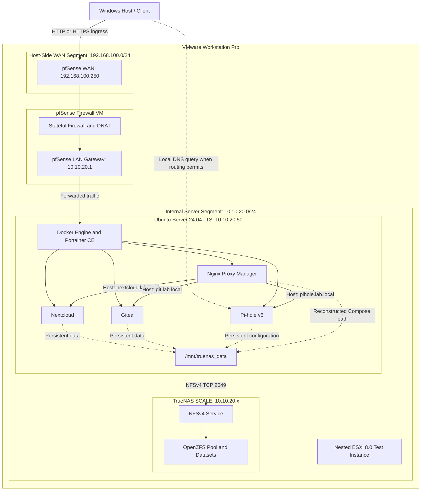

# Architecture Deep Dive: Virtualized Enterprise Network Infrastructure

---

## 1. Purpose and Scope

This document provides a comprehensive technical breakdown of the architecture, network topologies, subsystem relationships, and design decisions behind the **Virtualized Enterprise Network Infrastructure** project. 

The primary objective of this project is to model and analyze foundational enterprise data center patterns on a single physical host within a defined hardware envelope (16 GB RAM). Rather than deploying a monolithic, flat operating system or relying on unsegmented networks, the infrastructure simulates real-world enterprise infrastructure principles:
* Multi-tier virtualization and hypervisor workload distribution.
* Stateful perimeter security, NAT, and network isolation using a dedicated firewall.
* Separation of application execution from persistent application data through centralized network storage.
* Centralized ingress traffic consolidation (Layer 7 reverse proxying) and centralized local DNS resolution.

This deep dive is structured to support both academic documentation (specifically aligning with the university curriculum topic *"Kurumsal Ağ Altyapılarının Tasarımı" - Design of Enterprise Network Infrastructures*) and technical engineering reviews. It emphasizes architectural trade-offs, operational boundaries, and verification records rather than abstract theory.

---

## 2. Architectural Design Principles

The infrastructure is built upon core systems architecture principles. In this environment, every principle is mapped directly to a concrete implementation component:

### 2.1 Separation of Concerns
In traditional flat systems, a single server handles network routing, local storage, DNS resolution, and application workloads. If the operating system halts or is compromised, all services fail simultaneously.
* **In This Project:** Responsibilities are split into dedicated virtual nodes. Perimeter defense and routing are assigned exclusively to **pfSense**, storage pooling and data integrity to **TrueNAS SCALE**, and application runtime to **Ubuntu Server**. No node performs another node's primary function.

### 2.2 Network Perimeter Security & Segmentation
Enterprise systems enforce strict trust boundaries between client ingress networks and internal application/database networks.
* **In This Project:** The network is partitioned into two distinct virtual network segments: a simulated WAN segment (`192.168.100.0/24`) used for host-side ingress and a LAN segment (`10.10.20.0/24`) used by the compute and storage nodes. User-facing ingress is intentionally routed through pfSense and explicit Destination NAT (DNAT) rules. Exact direct host-to-LAN reachability depends on the VMware virtual-adapter configuration and is not treated as independently verified in this repository.

### 2.3 Compute and Storage Decoupling
Applications should remain stateless whenever possible. Storing application state directly on local virtual machine disks creates tight coupling, complicating migrations, disaster recovery, and scaling.
* **In This Project:** Persistent application data is intentionally externalized from the Ubuntu compute node and stored on TrueNAS SCALE through NFSv4. This reduces coupling between application runtime and storage, but it does not make the Ubuntu VM completely stateless: operating-system state, Docker runtime metadata, and other local configuration can still exist on the compute node.

### 2.4 Centralized Layer 7 Ingress
Exposing every internal web service on arbitrary high-numbered host ports (e.g., `host:8080`, `host:3000`) creates firewall complexity, exposes internal socket structures, and degrades user experience.
* **In This Project:** Normal application web ingress is consolidated on standard ports (`80/TCP` for HTTP and `443/TCP` for HTTPS) through **Nginx Proxy Manager**. Administrative interfaces such as NPM (`81/TCP`) and Portainer (`9443/TCP`) are documented separately. NPM routes application requests at Layer 7 based on the HTTP `Host:` header.

### 2.5 Centralized Local DNS
Relying on client-side static hosts files (`/etc/hosts` or `C:\Windows\System32\drivers\etc\hosts`) to resolve private domains is unmaintainable and unscalable across multiple endpoints.
* **In This Project:** An internal instance of **Pi-hole v6** provides centralized local DNS resolution and local DNS record management for the `.lab.local` namespace, directing service hostnames to the designated network ingress point.

### 2.6 Microservice Containerization
Running each service inside an independent virtual machine imposes severe memory and CPU kernel overhead, exceeding the available 16 GB hardware budget.
* **In This Project:** Applications run as OCI containers under **Docker Engine** on a single Ubuntu compute node. Containers share the host Linux kernel while Docker relies on Linux isolation mechanisms such as namespaces and cgroups.

### 2.7 Hardware Virtualization Abstraction
Hardware resources are pooled and dynamically partitioned through hypervisor abstraction, enabling different kernel architectures (FreeBSD and Linux) to execute concurrently on consumer bare-metal hardware.

---

## 3. Physical and Virtualization Architecture

The system topology bridges physical consumer hardware to an enterprise-modeled virtual environment via hypervisor abstraction:

```
[ Physical Bare-Metal Host: HP Victus 16 ]
 │  AMD Processor (8 Cores / 16 Threads) | 16 GB DDR5 RAM | Windows 11
 └── [ Type-2 Hypervisor: VMware Workstation Pro 25H2 ]
      │
      ├── [ VM 1: pfSense 2.7.x ]
      │     Dual-homed virtual router, firewall, NAT, and gateway engine.
      │
      ├── [ VM 2: TrueNAS SCALE ]
      │     OpenZFS storage controller, pool manager, and NFSv4 server.
      │
      ├── [ VM 3: Ubuntu Server 24.04 LTS ]
      │     Headless compute node, Docker Engine runtime, and Portainer host.
      │
      └── [ VM 4: Nested VMware ESXi 8.0 ]
            Nested-virtualization learning and evaluation testbed; not a core service host.
```

### 3.1 Node Roles and Justification

* **pfSense Virtual Appliance:**  
  * *Why a dedicated VM?* pfSense was placed in a separate VM to model an independent network perimeter and keep routing, firewall, and NAT responsibilities distinct from application workloads. This also enables a clear dual-homed boundary between the host-side WAN segment and the internal server LAN.
* **TrueNAS SCALE Storage Appliance:**  
  * *Why a dedicated storage VM?* A separate TrueNAS appliance was chosen to keep storage management, OpenZFS administration, and NFS service lifecycle distinct from the Ubuntu application runtime. This is a separation-of-concerns design choice for the lab rather than a requirement imposed by OpenZFS itself.
* **Ubuntu Server Compute Node:**  
  * *Why a minimal headless server?* A server installation without a desktop environment avoids unnecessary graphical components and leaves more of the limited 16 GB host memory budget available to infrastructure workloads.
* **Nested VMware ESXi 8.0 Instance:**  
  * *Role and Placement:* The ESXi instance was deployed strictly as a nested-virtualization learning and evaluation testbed. The documented VMware flags include `vhv.enable = "TRUE"` and `hypervisor.cpuid.v0 = "FALSE"`. **It does not host the core application workloads.** Core services (Nextcloud, Gitea, NPM, and Pi-hole) are hosted on the Ubuntu compute node.

---

## 4. Network Architecture and Segmentation

Network segmentation is implemented through separate VMware virtual network segments (VMnets) connected to the dual-homed pfSense instance:

```
+------------------------------------------------------------------------------------+
|                                PHYSICAL WORKSTATION                                |
|                           (Windows 11 Host: 192.168.100.x)                         |
+------------------------------------------------------------------------------------+
                                          │
                                          │ Access via Host Virtual Adapter
                                          ▼
============================== WAN Segment: 192.168.100.0/24 ========================
                                          │
                                          │ vtnet0 (192.168.100.250)
                                    +------------+
                                    |  pfSense   |
                                    |  Firewall  |
                                    +------------+
                                          │ vtnet1 (10.10.20.1 - Gateway)
                                          │
============================== LAN Segment: 10.10.20.0/24 ==========================
                  │                                               │
                  │ ens33 (Static)                                │ Static / Dynamic
                  ▼                                               ▼
        +-------------------+                           +-------------------+
        |   Ubuntu Server   |                           |   TrueNAS SCALE   |
        |   (10.10.20.50)   | <==== NFSv4 (TCP 2049) ===|   (10.10.20.x)    |
        +-------------------+                           +-------------------+
```

### 4.1 Subnet Boundaries

1. **WAN Segment (`192.168.100.0/24`):**  
   * **Nature:** Host-accessible virtual network adapter segment.
   * **Purpose:** Acts as the external untrusted zone from the perspective of the homelab. The physical Windows workstation resides on this subnet and accesses homelab services through pfSense's external interface.
   * **Firewall Boundary:** All incoming connection attempts to this network interface (`vtnet0`: `192.168.100.250`) are rejected by default unless matched against an active state in the state table or explicitly forwarded via DNAT.
2. **LAN Segment (`10.10.20.0/24`):**  
   * **Nature:** Internal VMware virtual network segment (`VMnet`).
   * **Purpose:** Acts as the internal server zone for Ubuntu and TrueNAS. The lab design uses pfSense (`10.10.20.1`) as the default gateway for routed traffic. Exact direct reachability from the Windows host to this LAN depends on the VMware host-adapter configuration and is intentionally not asserted here as a verified property.

### 4.2 Network Interface and Addressing Matrix

| Network / Interface | IP Address / CIDR | Functional Role | Connected Nodes & Reachability |
| :--- | :--- | :--- | :--- |
| **pfSense WAN (`vtnet0`)** | `192.168.100.250/24` | Ingress boundary, DNAT target | Physical host browser, PuTTY SSH client, DNS queries |
| **pfSense LAN (`vtnet1`)** | `10.10.20.1/24` | Default gateway, SPI firewall | Gateway for Ubuntu Server and TrueNAS SCALE |
| **Ubuntu Server (`ens33`)**| `10.10.20.50/24` | Compute node (Docker host) | Isolated LAN; accessible externally only via pfSense DNAT |
| **TrueNAS SCALE** | `10.10.20.x/24` | Centralized storage controller | Isolated LAN; accessible to Ubuntu via NFSv4 (TCP 2049) |
| **Pi-hole DNS Service** | `10.10.20.50:53` (LAN service endpoint) | Centralized local DNS resolver | Client reachability depends on the lab routing / VMware adapter configuration; DNS port 53 is not listed as one of the verified pfSense DNAT rules |

### 4.3 pfSense Firewall Policies
* **Stateful Packet Inspection (SPI):** Inbound packets on WAN are validated against active outbound connection states. Unsolicited inbound packets are dropped by default.
* **RFC 1918 / Bogon Filtering Deconfliction:** Because the WAN interface itself resides on a private subnet (`192.168.100.0/24`), pfSense's default rules to *Block private networks* and *Block bogon networks* were explicitly disabled on the WAN interface. Without this modification, pfSense drops all traffic originating from the host workstation.

---

## 5. Ingress and Port Forwarding Architecture

For the documented user-facing ingress path, pfSense executes Destination NAT (DNAT) to expose selected services from the internal Ubuntu compute node (`10.10.20.50`) through the WAN-side address. Direct host-to-LAN reachability is not assumed here because it depends on the VMware host-adapter configuration.

### 5.1 Ingress Flow
When the host workstation connects to `192.168.100.250` on an authorized port:
1. The packet hits pfSense WAN interface `vtnet0`.
2. pfSense evaluates the NAT rules. If a match exists, the destination IP is rewritten to `10.10.20.50` and the port is remapped if configured.
3. The firewall verifies the accompanying WAN filter rule and passes the packet to the LAN interface `vtnet1`.
4. The packet arrives at Ubuntu (`10.10.20.50`), where the host networking stack and Docker networking layer deliver it to the appropriate published container port.

```
[ Host Browser / Terminal ]
             │
             │ Target: 192.168.100.250:Port
             ▼
[ pfSense WAN: vtnet0 (192.168.100.250) ]
             │
             │ Stateful NAT Translation
             ▼
[ pfSense LAN: vtnet1 (10.10.20.1) ]
             │
             │ Forwarded Packet: 10.10.20.50:Target_Port
             ▼
[ Ubuntu Compute Node (10.10.20.50) ]
```

### 5.2 Destination NAT Translation Table

The table below reflects the verified port forward rules active on the pfSense firewall. For the sanitized version-controlled configuration artifact, refer to [configs/pfsense/nat-rules-summary.csv](../configs/pfsense/nat-rules-summary.csv).

| External Interface | External Port | Target IP (LAN) | Internal Port | Protocol | Target Service Description |
| :--- | :--- | :--- | :--- | :---: | :--- |
| **WAN (`192.168.100.250`)** | `2222` | `10.10.20.50` | `22` | TCP | Remote SSH shell to Ubuntu compute node |
| **WAN (`192.168.100.250`)** | `80` | `10.10.20.50` | `80` | TCP | HTTP web ingress via Nginx Proxy Manager |
| **WAN (`192.168.100.250`)** | `443` | `10.10.20.50` | `443` | TCP | HTTPS web ingress via Nginx Proxy Manager |
| **WAN (`192.168.100.250`)** | `81` | `10.10.20.50` | `81` | TCP | Nginx Proxy Manager admin management dashboard |
| **WAN (`192.168.100.250`)** | `9443` | `10.10.20.50` | `9443` | TCP | Portainer CE SSL container management console |

### 5.3 Management Port Deconfliction
The pfSense WebConfigurator normally uses HTTPS on `443/TCP`. In this lab, reserving the WAN-side `443/TCP` ingress for Nginx Proxy Manager required moving the pfSense management interface to another port.

To resolve this without compromising firewall administration, the WebConfigurator was reassigned to listen on port `8443/TCP` (`System > Advanced > Admin Access`). This is a **local service listening port reconfiguration**, not a NAT port forward rule:
* **pfSense WebConfigurator URL:** `https://192.168.100.250:8443`
* **Lab Ingress HTTPS Port:** `https://192.168.100.250:443` (reserved for NPM forwarding in the lab)

---

## 6. Compute Architecture

The compute tier is hosted on a single virtual machine running headless **Ubuntu Server 24.04 LTS**. This node functions as the application container runtime host. Persistent application data is primarily externalized to the TrueNAS-backed NFS mount, while operating-system state and local runtime/configuration data may still remain on the Ubuntu VM.

```
+-----------------------------------------------------------------------------+
|                     UBUNTU SERVER 24.04 LTS COMPUTE NODE                    |
|                                (10.10.20.50)                                |
+-----------------------------------------------------------------------------+
   │
   ├── Networking Layer
   │     └── Netplan: Static IP (10.10.20.50/24) | Gateway: pfSense (10.10.20.1)
   │
   ├── Kernel & System Configuration
   │     ├── LVM2: Online dynamic volume extension (/dev/ubuntu-vg/ubuntu-lv)
   │     └── systemd-resolved: Decoupled local stub resolver (Released Port 53)
   │
   ├── Application Runtime (Docker Engine CE)
   │     ├── Portainer CE: Container lifecycle via /var/run/docker.sock
   │     └── Microservice Stack: NPM, Pi-hole v6, Nextcloud, Gitea
   │
   └── Decoupled Storage Layer
         └── Linux VFS / nfs.ko: Mounted to TrueNAS SCALE at /mnt/truenas_data
```

### 6.1 Minimal Operating System Footprint
To work within the physical 16 GB RAM limitation, Ubuntu Server was provisioned as a headless server without a desktop environment. This avoids unnecessary graphical-service overhead and leaves more of the available host memory budget for Docker and application workloads.

### 6.2 Declarative Static Networking (Netplan)
DHCP dependencies inside the isolated server segment were eliminated to prevent dynamic IP drift across reboots. Network parameters are deterministically bound via Netplan:
* **Assigned Interface:** `ens33`
* **Static IP / Mask:** `10.10.20.50/24`
* **Default Gateway:** `10.10.20.1` (pfSense LAN interface)
* **Upstream DNS Resolvers:** `10.10.20.1` (pfSense resolver fallback) and `8.8.8.8`

The verified network configuration template is documented in [configs/netplan/50-cloud-init.yaml](../configs/netplan/50-cloud-init.yaml).

### 6.3 Dynamic LVM Volume Management & Online Expansion
During container image layer extraction, the root filesystem encountered a `no space left on device` condition. Inspection of the LVM layout showed that `/dev/ubuntu-vg/ubuntu-lv` could be extended using free extents that remained available in the `ubuntu-vg` Volume Group.

Rather than powering down the node or reprovisioning partitions, the storage was expanded live using Linux Logical Volume Manager (LVM2) and online ext4 filesystem resizing:
1. `lvextend -l +100%FREE /dev/ubuntu-vg/ubuntu-lv`: Appended all available Physical Extents from the volume group to the logical volume.
2. `resize2fs /dev/mapper/ubuntu--vg-ubuntu--lv`: Instructed the ext4 kernel driver to expand the filesystem block tables online without unmounting `/`.

This operational remediation is encapsulated in the safety-checked helper script [scripts/lvm-online-extend.sh](../scripts/lvm-online-extend.sh).

### 6.4 Linux Stub Resolver Decoupling (Port 53 Freeing)
By default, modern Ubuntu releases run `systemd-resolved`, which binds a local DNS stub caching listener to `127.0.0.53:53`. When deploying Pi-hole inside Docker, attempting to bind host port `53/TCP` or `53/UDP` resulted in an immediate socket binding failure:  
`bind: address already in use (0.0.0.0:53)`.

To resolve this conflict:
* The native stub listener was disabled by setting `DNSStubListener=no` inside `/etc/systemd/resolved.conf`.
* The resolver configuration was reloaded so that the local stub listener no longer occupied port 53, allowing the Pi-hole container to bind the required host DNS ports. Host-side name resolution was then revalidated as part of the troubleshooting process.

The corresponding configuration artifact is preserved in [configs/systemd/resolved.conf](../configs/systemd/resolved.conf).

---

## 7. Container and Service Architecture

Application workloads are orchestrated using **Docker Engine CE** and managed via **Portainer Community Edition**. Rather than allocating dedicated virtual machines for each business service, containerization enables process-level isolation within the shared Linux kernel.

### 7.1 Container Isolation Mechanics
Unlike virtual machines that require distinct operating system kernels and hardware emulation layers, Docker containers leverage native Linux kernel features:
* **Control Groups (cgroups):** Provide resource accounting and can enforce CPU or memory limits when such limits are configured.
* **Namespaces:** Isolate process IDs (`pid`), network interfaces (`net`), filesystem mount points (`mnt`), and inter-process communication (`ipc`).
* **Host Socket Binding:** Portainer manages the engine directly by mounting the host UNIX socket (`/var/run/docker.sock`), removing the need to expose the unencrypted Docker API over the network.

### 7.2 Microservice Inventory and Matrix

The table below outlines the containerized services deployed on the Ubuntu compute node. A reconstructed declarative representation of the verified service layout is available in [compose/docker-compose.yml](../compose/docker-compose.yml); it was created for documentation and reproducibility rather than used as the original deployment source.

| Container Name | Core Role | Bound Host Ports | Network Segment | Persistent Storage Mount Point |
| :--- | :--- | :--- | :--- | :--- |
| **`nginx-proxy-manager`** | Layer 7 ingress router and reverse proxy | `80:80`<br>`443:443`<br>`81:81` | Live network mode not independently documented; reconstructed Compose uses Docker's default networking | Reconstructed Compose paths: `/mnt/truenas_data/npm/data` and `/mnt/truenas_data/npm/letsencrypt` |
| **`pihole`** | Centralized local DNS service and DNS filtering | `53:53/tcp`<br>`53:53/udp`<br>`8053:80/tcp` | Live network mode not independently documented; reconstructed Compose uses Docker's default networking | `/mnt/truenas_data/pihole/etc-pihole` |
| **`nextcloud`** | File collaboration and web application | `8080:80` | Live network mode not independently documented; reconstructed Compose uses Docker's default networking | `/mnt/truenas_data/nextcloud/data` |
| **`gitea`** | Lightweight Source Code Management (SCM) | `3000:3000` | Live network mode not independently documented; reconstructed Compose uses Docker's default networking | `/mnt/truenas_data/gitea` |
| **`portainer-ce`** | Container management interface | `9443:9443` | Live network mode not independently documented | `/var/run/docker.sock` is a Docker management socket, not application persistent storage |

### 7.3 Inter-Service Relationships and Port Management
* **Web Port Consolidation:** Services such as Nextcloud (`8080`), Gitea (`3000`), and the Pi-hole web interface (`8053`) use backend host ports on Ubuntu. Those backend ports are not part of the verified pfSense WAN DNAT matrix; normal user-facing web ingress is consolidated through Nginx Proxy Manager on ports 80/443.
* **Pi-hole Port Remapping:** Because Nginx Proxy Manager occupies host port 80 for HTTP ingress, the Pi-hole web interface is remapped from container port `80` to host port `8053`.
* **Pi-hole v6 Listening Mode:** In the reconstructed Compose specification, Pi-hole v6 utilizes `FTLCONF_dns_listeningMode: 'ALL'` to accept queries forwarded across the Docker virtual bridge interface.

---

## 8. Storage Architecture and Compute/Storage Decoupling

A central architectural goal of this project is to **separate application compute from persistent application data**. The Ubuntu node runs the application containers, while persistent service data is placed on **TrueNAS SCALE** and presented to Ubuntu over NFSv4. This reduces compute/storage coupling without implying that the Ubuntu VM itself is completely stateless.

```
+------------------------------------+          +------------------------------------+
|       UBUNTU COMPUTE NODE          |          |       TRUENAS STORAGE NODE         |
|          (10.10.20.50)             |          |           (10.10.20.x)             |
+------------------------------------+          +------------------------------------+
|  Docker Containers                 |          |  OpenZFS Storage Pool (zpool)      |
|  (Gitea, Nextcloud, Pi-hole, NPM)  |          |                                    |
|          │                         |          |   ├── dataset: /nextcloud (lz4)    |
|          ▼ Bind Mounts             |          |   ├── dataset: /gitea     (lz4)    |
|  Local Directory:                  |          |   └── dataset: /pihole    (lz4)    |
|  /mnt/truenas_data                 |          |                                    |
|          │                         |          |  NFS service                       |
|  Linux VFS (nfs.ko)                |  NFSv4   |                                    |
|  /etc/fstab (_netdev option)       | ───────> |  Maproot: root:root                |
+------------------------------------+ (TCP:2049)+------------------------------------+
```

The verified storage design centers on the TrueNAS-backed mount at `/mnt/truenas_data`. Dataset claims in this document are limited to the datasets previously verified for Nextcloud, Gitea, and Pi-hole. The NPM storage path shown in the reconstructed Compose file is retained as a reproducibility template rather than presented as proof of a separately verified NPM dataset.

### 8.1 TrueNAS SCALE & OpenZFS Storage Pool
TrueNAS SCALE operates as an independent virtual appliance managing a dedicated virtual disk pool (`zpool`).
* **Transactional Copy-on-Write (CoW):** OpenZFS uses copy-on-write semantics rather than overwriting active blocks in place. This provides transactional consistency benefits, but it does not replace backups, redundancy, or proper shutdown/power protection.
* **Dataset Segmentation:** Verified datasets were provisioned for Nextcloud, Gitea, and Pi-hole. The documented storage configuration uses `lz4` compression. NPM paths shown in the reconstructed Compose file should be treated as a reproducibility artifact rather than proof of an independently verified dedicated NPM dataset.

### 8.2 NFSv4 Protocol & Persistent Mounting
Storage is exported across the private network (`10.10.20.0/24`) using NFSv4 over TCP port 2049:
* On the Ubuntu host, shares are mounted at `/mnt/truenas_data`.
* In `/etc/fstab`, the mount entry specifies `defaults,_netdev`. The `_netdev` directive is critical: it prevents systemd from attempting to mount the remote filesystem before the network interfaces and routing table are initialized during the boot sequence.

The read-only diagnostic script [scripts/nfs-mount-verify.sh](../scripts/nfs-mount-verify.sh) validates directory presence, active mount status, filesystem type, and directory readability.

### 8.3 The NFS Root Squashing Problem (UID Mapping Failure)
During container/application initialization, services encountered `Permission Denied (errno 13)` errors when attempting to write under `/mnt/truenas_data`.

* **Root Cause:** By default, NFS exports enforce **Root Squashing** as a security measure. When a container process running as UID 0 (`root`) attempted to create directories or set POSIX ownership, the NFS daemon mapped UID 0 to the unprivileged `nobody` user (`UID 65534`).
* **Remediation:** In the TrueNAS SCALE NFS export options, access was reconfigured to define:
  * **Maproot User:** `root`
  * **Maproot Group:** `root`
  In this lab, that setting allowed container initialization processes running as UID 0 to establish the required ownership on the exported storage. Because Maproot grants elevated server-side identity mapping, it should be treated as a deliberate lab-specific trade-off rather than a universal NFS recommendation.

*(Note: Detailed ZFS behavior, storage layout, and dataset design are covered in `docs/storage-and-zfs-design.md`.)*

---

## 9. DNS and Application Access Flow

To illustrate the integration across the physical host, perimeter firewall, ingress proxy, local DNS, and storage fabric, the following walkthrough details the end-to-end lifecycle of an HTTP request navigating to `http://git.lab.local`.

```
STEP 1: DNS QUERY & RESOLUTION
[ Host Workstation (Windows 11) ]
       │
       │ Sends a local DNS query for "git.lab.local"
       │ (exact host-to-Pi-hole reachability path depends on VMware lab networking)
       ▼
[ Pi-hole v6 DNS Service (10.10.20.50:53) ]
       │
       │ Evaluates /etc/pihole/custom.list
       ▼
[ Returns Ingress IP: 192.168.100.250 ]

---------------------------------------------------------------------------------

STEP 2: NETWORK PERIMETER INGRESS & DNAT
[ Host Workstation ]
       │
       │ Sends HTTP TCP SYN to 192.168.100.250:80
       ▼
[ pfSense WAN: vtnet0 (192.168.100.250) ]
       │
       │ 1. Matches DNAT Rule: 192.168.100.250:80 -> 10.10.20.50:80
       │ 2. Rewrites Destination Packet Header
       │ 3. Forwards across LAN interface: vtnet1 (10.10.20.1)
       ▼
[ Ubuntu Host Interface: ens33 (10.10.20.50) ]

---------------------------------------------------------------------------------

STEP 3: LAYER 7 INGRESS & REVERSE PROXYING
[ Ubuntu Linux Kernel / Docker iptables ]
       │
       │ Bridges packet to Nginx Proxy Manager container on Port 80
       ▼
[ Nginx Proxy Manager (OpenResty Engine) ]
       │
       │ 1. Accepts the incoming HTTP connection
       │ 2. Inspects HTTP Header: "Host: git.lab.local"
       │ 3. Applies the enabled "Block Common Exploits" option
       │ 4. Proxies the request to: http://10.10.20.50:3000
       ▼
[ Gitea Application Container (Listening on Port 3000) ]

---------------------------------------------------------------------------------

STEP 4: SERVICE PROCESSING & DECOUPLED STORAGE I/O
[ Gitea Application Core ]
       │
       │ Handles the HTTP request and accesses application/repository data
       │ under the container's /data path, backed by the configured persistent mount
       ▼
[ Ubuntu VFS Kernel Driver (nfs.ko) ]
       │
       │ Translates local filesystem call into NFSv4 RPC operations
       │ Transmits RPC request over isolated LAN (TCP:2049)
       ▼
[ TrueNAS SCALE Storage Controller (10.10.20.x) ]
       │
       │ Validates Maproot permissions and retrieves data blocks from ZFS ARC/Pool
       ▼
[ Data blocks streamed back to Ubuntu -> Gitea -> NPM -> pfSense -> Host Browser ]
```

---

## 10. End-to-End Architecture Diagram

The diagram below provides a unified architectural view of the physical host, hypervisor boundaries, network segments, ingress paths, containerized services, and decoupled storage fabric.



---

## 11. Dependency and Boot Order

The lab benefits from a **recommended operational startup sequence** because application services depend on storage availability and user-facing access depends on routing/ingress services. This is not a strict network-level DAG: Ubuntu and TrueNAS share the same `10.10.20.0/24` LAN, so their direct NFS traffic does not need to traverse pfSense.

```
[ Recommended Step 1: pfSense Firewall & Gateway ]
                   │
                   ▼ (WAN ingress and default gateway available)
[ Recommended Step 2: TrueNAS SCALE Storage Node ]
                   │
                   ▼ (OpenZFS pool and NFSv4 export available)
[ Recommended Step 3: Ubuntu Server Compute Node ]
                   │
                   ▼ (Static LAN configuration and /mnt/truenas_data mount)
[ Recommended Step 4: Ingress and DNS Services ]
                   │ (Docker starts Pi-hole and Nginx Proxy Manager)
                   ▼
[ Recommended Step 5: Application Services ]
                     (Nextcloud and Gitea use the expected persistent paths)
```

### 11.1 Recommended Startup Sequence and Rationale

1. **Step 1: Perimeter Routing & Firewall (pfSense)**
   * **Operational Role:** Bringing pfSense up first restores the lab's default gateway, WAN-side ingress, NAT rules, and routed external connectivity.
   * **Important Boundary:** Ubuntu-to-TrueNAS traffic within `10.10.20.0/24` is local-subnet traffic and does not require pfSense to forward the NFS packets.
2. **Step 2: Centralized Storage Fabric (TrueNAS SCALE)**
   * **Operational Role:** TrueNAS should be ready before Ubuntu-dependent application storage is expected to mount.
   * **Failure Condition if Misordered:** If Ubuntu evaluates the NFS mount before the TrueNAS pool/export is ready, the mount may fail or time out and require a later retry.
3. **Step 3: Compute Node (Ubuntu Server 24.04 LTS)**
   * **Operational Role:** Ubuntu initializes its static LAN configuration and attaches `/mnt/truenas_data`.
   * **Mitigation Flag:** The `/etc/fstab` entry uses `_netdev`, marking the filesystem as network-dependent so mounting is coordinated with network availability. This does not by itself guarantee that the remote NFS server has already finished starting.
4. **Step 4: Core Ingress & Resolution (Pi-hole & Nginx Proxy Manager)**
   * **Dependency:** Docker Engine must be running on Ubuntu.
   * **Operational Requirement:** Pi-hole must bind the DNS ports used by clients, while Nginx Proxy Manager must bind the configured web ingress ports before those services are reachable through their intended paths.
5. **Step 5: Application Services (Nextcloud & Gitea)**
   * **Dependency:** Their expected persistent NFS-backed paths should be available before normal application operation.
   * **Failure Condition if Misordered:** Starting containers while the expected remote mount is absent can cause writes to fall back to local directories at the mount path, creating an inconsistent runtime state. The NFS mount should therefore be verified before application startup.

---

## 12. Security Boundaries

The security architecture of this homelab is described in terms of concrete network boundaries, stateful packet filtering, ingress rules, management-port separation, and repository sanitization:

```
+----------------------------------------------------------------------------------+
|                            SIMULATED WAN / HOST-SIDE ZONE                               |
|                     (Physical Host Subnet: 192.168.100.0/24)                     |
+----------------------------------------------------------------------------------+
                                         │
                   [ pfSense Ingress Boundary: 192.168.100.250 ]
                                         │
                   ├── Stateful WAN Filtering
                   ├── Management Port Separation (WebConfigurator: 8443)
                   └── Explicit Destination NAT Rules
                                         │
+----------------------------------------------------------------------------------+
|                            INTERNAL SERVER ZONE                                |
|                       (Private Subnet: 10.10.20.0/24)                            |
+----------------------------------------------------------------------------------+
   │
   ├── Compute Node (Ubuntu Server: 10.10.20.50)
   │     ├── systemd-resolved Stub Listener Disabled (Port 53 reserved for Pi-hole)
   │     ├── Administrative Access Paths (Portainer 9443, SSH 22 via WAN 2222)
   │     └── Docker Daemon UNIX Socket Isolation (/var/run/docker.sock)
   │
   └── Storage Node (TrueNAS SCALE: 10.10.20.x)
         ├── NFSv4 Service Used on Internal 10.10.20.0/24 Segment
         └── Explicit Maproot User/Group Enforcement
```

### 12.1 Perimeter Defense & Stateful Inspection
* **Stateful WAN Filtering:** The documented ingress design uses pfSense stateful filtering together with explicit port-forward rules. The verified DNAT mappings are summarized in [configs/pfsense/nat-rules-summary.csv](../configs/pfsense/nat-rules-summary.csv).
* **RFC 1918 Deconfliction:** The default pfSense rule blocking RFC 1918 private subnets on WAN was disabled specifically to accommodate communication with the physical host network adapter, maintaining boundary controls through explicit firewall rules rather than blanket drops.

### 12.2 Ingress Port Separation & Service Exposure
* **Management Port Reassignment:** By relocating the pfSense WebConfigurator from port `443` to `8443/TCP`, the standard HTTPS port was reserved exclusively for Nginx Proxy Manager ingress, preventing administrative interface exposure to regular web traffic.
* **Backend Port Exposure Boundary:** Backend service ports (Nextcloud `8080`, Gitea `3000`, and Pi-hole web `8053`) are not included in the verified pfSense WAN DNAT matrix. Normal user-facing web access is routed through Nginx Proxy Manager rather than adding separate WAN forwards for each backend service.
* **Storage Access Boundaries:** The NFS service is used on the internal `10.10.20.0/24` server segment between Ubuntu and TrueNAS. Exact direct Windows-host reachability to that segment depends on VMware adapter configuration and is not asserted as a verified property here.

### 12.3 Repository Sanitization
To prevent credential leaks:
* Live `.env` files, SSH private keys, virtual machine disks (`.vmdk`), and database backups are excluded via [.gitignore](../.gitignore).
* Template configurations (such as [compose/.env.example](../compose/.env.example)) use empty values or placeholders, requiring explicit user definition prior to execution.

---

## 13. Design Trade-offs and Limitations

Engineering under a fixed physical constraint (single bare-metal laptop with 16 GB RAM) required practical trade-offs:

| Architectural Domain | Enterprise Data Center Standard | Homelab Implementation | Technical Justification & Trade-off |
| :--- | :--- | :--- | :--- |
| **Physical Redundancy** | Multi-chassis servers, redundant PSUs, dual top-of-rack switches. | Single bare-metal host (HP Victus 16). | Single Point of Failure (SPOF). Power loss or host OS reboot halts the entire virtualized topology. |
| **RAM Budgeting** | Enterprise environments commonly use substantially larger memory pools and may use ECC memory. | 16 GB DDR5 shared by Windows 11 and all lab VMs. | The limited memory budget required conservative VM sizing and favored containerization for application services. |
| **Network Switching** | Managed switching and VLAN segmentation are common in enterprise environments. | Separate VMware virtual network segments (VMnets). | Provides logical network separation for the lab without claiming that 802.1Q VLAN trunking was implemented. |
| **High Availability (HA)** | Redundant firewalls, storage replication, and clustered compute are common enterprise patterns. | Standalone virtual appliances on one physical host. | HA was outside the scope of this single-host learning environment and would require additional independent resources and failure domains. |
| **TLS / SSL Certificates** | Public CA validation with managed certificate renewal is common for public services. | Public TLS was not implemented for the private `.lab.local` namespace; HTTP was used for development access. | Private `.lab.local` names are not suitable for public CA validation, so public certificate automation was outside the scope of this lab. |
| **Storage Fault Tolerance** | Multi-disk ZFS mirrors (RAIDZ2) across dedicated SAS/SATA drives. | Single virtual disk backing the OpenZFS pool. | Provides filesystem-level Copy-on-Write and dataset management, but lacks physical drive redundancy against host NVMe failure. |

---

## 14. Verified vs. Reconstructed Artifacts

To maintain engineering integrity, the table below clearly distinguishes between components verified in the live virtual environment and declarative templates reconstructed for repository documentation:

| Artifact / Component | Category / Status | Technical Explanation |
| :--- | :---: | :--- |
| **Physical Host & VMware Workstation Pro** | ✅ Verified Live Implementation | Tested on bare-metal HP Victus 16 running Windows 11 and VMware Workstation Pro 25H2. |
| **pfSense 2.7.x Firewall & Routing Engine** | ✅ Verified Live Implementation | Dual-homed network segmentation, gateway routing (`10.10.20.1`), and SPI firewall rules verified live. |
| **pfSense DNAT Matrix & WebConfigurator Relocation** | ✅ Verified Live Implementation | Tested port translation on ports 2222, 80, 443, 81, and 9443; management interface verified on port 8443. |
| **TrueNAS SCALE OpenZFS Storage Fabric** | ✅ Verified Live Implementation | Storage pool, datasets (`/nextcloud`, `/gitea`, `/pihole`), and NFSv4 export with Maproot verified live. |
| **Ubuntu Server 24.04 LTS Compute Node** | ✅ Verified Live Implementation | Headless compute instance operating with static Netplan network configuration. |
| **Dynamic LVM Online Storage Expansion** | ✅ Verified Live Implementation | Live filesystem and volume expansion verified during runtime without rebooting (`lvextend`, `resize2fs`). |
| **systemd-resolved Stub Decoupling (Port 53)** | ✅ Verified Live Implementation | Verified release of host port 53 via `DNSStubListener=no` to allow Pi-hole container binding. |
| **Docker Containers via Portainer CE** | ✅ Verified Live Implementation | Runtime execution of NPM, Pi-hole v6, Nextcloud, and Gitea verified via Portainer CE. |
| **Nested VMware ESXi 8.0 Test Instance** | ✅ Verified Live Implementation | Hardware passthrough flags (`vhv.enable`) validated; isolated from core application workload delivery. |
| **`compose/docker-compose.yml`** | 🔄 Reconstructed Documentation Artifact | Declarative Compose template reconstructed from the verified live service definitions, port bindings, and storage mappings for documentation and reproducibility. |
| **`compose/.env.example`** | 🔄 Reconstructed Documentation Artifact | Sanitized environment variable template designed to prevent credential exposure in Git. |
| **`configs/netplan/50-cloud-init.yaml`** | 🔄 Reconstructed Documentation Artifact | Reconstructed configuration template representing the verified static Netplan network settings. |
| **`configs/systemd/resolved.conf`** | 🔄 Reconstructed Documentation Artifact | Reconstructed snippet capturing the exact configuration directive used to release port 53. |
| **`configs/pihole/custom.list`** | 🔄 Reconstructed Documentation Artifact | Plaintext DNS mapping table reconstructing the verified `.lab.local` local DNS records. |
| **`configs/pfsense/nat-rules-summary.csv`** | 🔄 Reconstructed Documentation Artifact | Sanitized tabular summary documenting verified DNAT rules in place of raw XML configuration backups. |
| **`scripts/lvm-online-extend.sh`** | 🔄 Reconstructed Documentation Artifact | Operational recovery script encapsulating manual CLI commands with interactive safety checks. |
| **`scripts/nfs-mount-verify.sh`** | 🔄 Reconstructed Documentation Artifact | Read-only diagnostic script reconstructing manual mount verification steps. |
| **Active Directory / LDAP Authentication** | 🟡 Architectural Scope / Future Improvement | Centralized directory integration was considered as future architectural scope but was not implemented in the live lab. |

---

## 15. Key Engineering Takeaways

The deployment and troubleshooting of this virtualized enterprise network infrastructure yielded several foundational systems engineering insights:

1. **Separating Compute and Persistent Data Reduces Coupling:** Moving persistent application data to TrueNAS over NFSv4 makes the application runtime less dependent on the Ubuntu VM's local disk, while still leaving operating-system and runtime configuration that must be managed separately.
2. **Private WAN Addressing Requires Deliberate pfSense Configuration:** Because this lab's pfSense WAN address is itself in RFC1918 space, the WAN options that block private and bogon networks had to be adjusted so the host-side lab traffic was not discarded.
3. **LVM Capacity Should Be Checked Before Large Container Deployments:** In this lab, the root logical volume filled while free extents were still available in the volume group. Inspecting `vgs`, `lvs`, and filesystem usage made it possible to extend the existing ext4 filesystem online.
4. **Host Services Can Conflict with Container Port Bindings:** In this Ubuntu setup, the `systemd-resolved` stub listener occupied port 53 and conflicted with Pi-hole's DNS binding. Reconfiguring the stub listener resolved the conflict.
5. **NFS Identity Mapping Matters for Containerized Workloads:** The observed write failures were tied to NFS root-squashing / identity mapping rather than only local POSIX permissions. `Maproot: root:root` was used as a lab-specific remediation and carries a security trade-off that should not be generalized blindly.
6. **Reverse Proxying Reduces WAN Port Proliferation:** Layer 7 host-based routing via Nginx Proxy Manager standardizes normal web ingress on ports 80/443 and reduces the need to create separate pfSense WAN forwards for each backend web service.
7. **Centralized Local DNS Simplifies Client Configuration:** Using Pi-hole to manage local `.lab.local` records reduces dependence on per-client static hosts files and centralizes local service-name management.
8. **Startup Order Should Reflect Service Dependencies:** A recommended sequence of pfSense, TrueNAS, Ubuntu, Docker infrastructure services, and application services reduces avoidable ingress and NFS-mount problems, while recognizing that same-subnet Ubuntu-to-TrueNAS NFS traffic does not traverse pfSense.
9. **Hardware Constraints Drive Architectural Discipline:** Modeling a multi-tier infrastructure within a 16 GB RAM budget requires careful VM sizing, a headless compute server, and conscious trade-offs between full virtual machines and containers.
10. **Engineering Integrity Requires Transparent Provenance:** A professional infrastructure portfolio must clearly separate what was executed and verified in live environments from templates reconstructed for documentation and reproducibility.