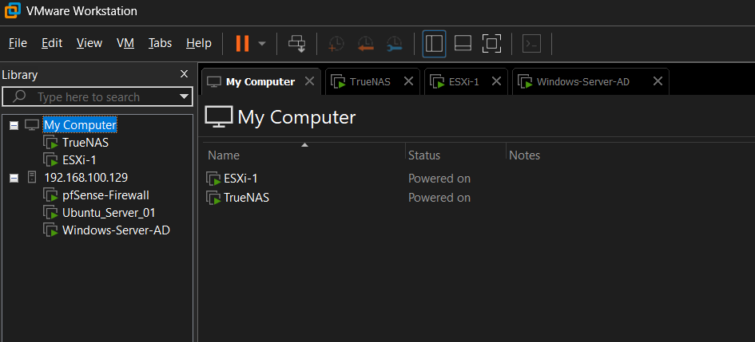
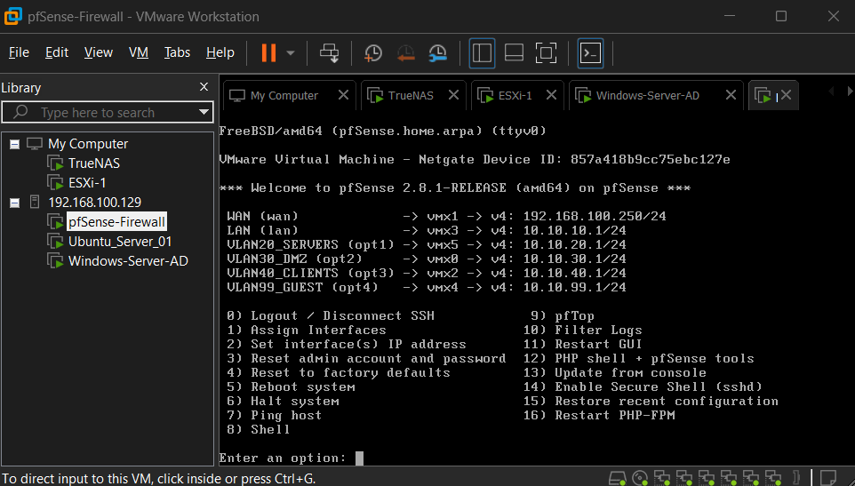
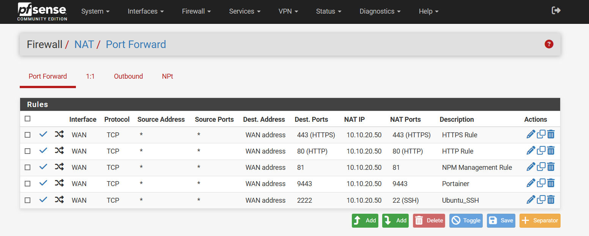
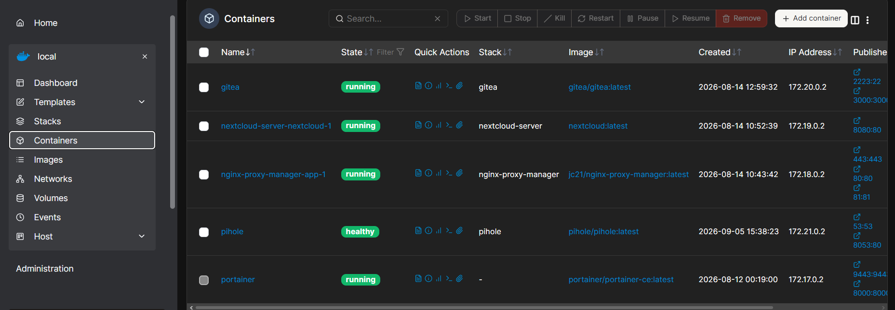
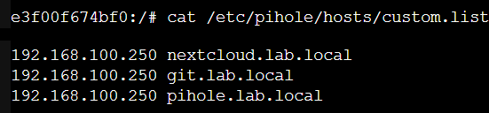
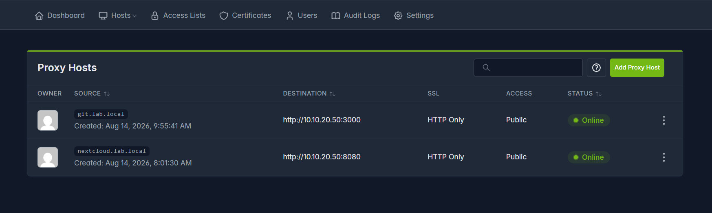
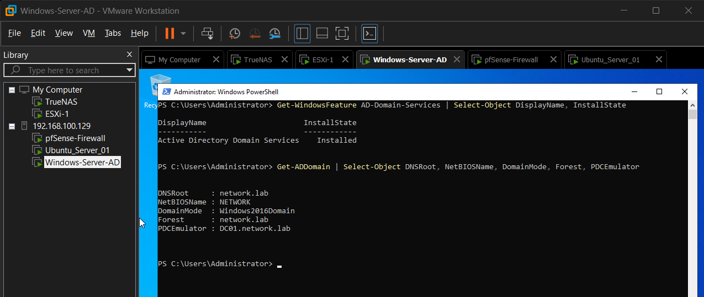
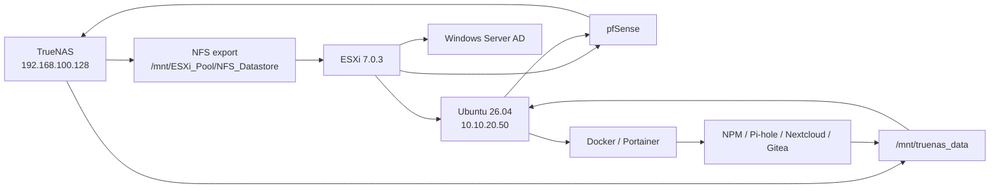

# Architecture Deep Dive: Virtualized Enterprise Network Infrastructure

---

## 1. Purpose and Scope

This document describes the **verified final architecture** of the Virtualized Enterprise Network Infrastructure homelab. It focuses on the relationship between the physical host, VMware Workstation, nested ESXi, pfSense, TrueNAS, Ubuntu, Windows Server Active Directory, and the containerized service layer.

The project aligns with the academic topic **“Kurumsal Ağ Altyapılarının Tasarımı” (Design of Enterprise Network Infrastructures)** and is intentionally framed as a single-host learning environment rather than a production deployment.

The most important architectural characteristics are:

- a Type-2 hypervisor on the physical Windows host;
- a nested ESXi Type-1 hypervisor;
- a dedicated pfSense routing/firewall VM;
- multiple routed virtual network zones;
- centralized TrueNAS/OpenZFS storage;
- an NFS datastore consumed by ESXi;
- the same NFS export mounted by Ubuntu for application persistence;
- an Ubuntu Docker compute node;
- Windows Server 2022 Active Directory Domain Services;
- Pi-hole v6 local DNS and Nginx Proxy Manager reverse proxying.

---

## 2. Evidence and Provenance Model

The repository distinguishes between:

### Verified live implementation

A fact is treated as verified when it is supported by a live system view, command output, or an explicitly preserved configuration/operation.

Examples:

- pfSense interface addresses and NAT rules;
- ESXi `NFS_Datastore`;
- Ubuntu `findmnt` and route output;
- Portainer container state;
- NPM Proxy Hosts;
- Pi-hole local DNS records;
- Active Directory domain output.

### Reconstructed repository artifact

Some files were created after the lab was built so the project could be reviewed and reproduced more easily.

Examples:

- consolidated `compose/docker-compose.yml`;
- sanitized pfSense NAT CSV;
- helper shell scripts;
- reconstructed Netplan/systemd templates.

Reconstructed files are not presented as proof that the live system was originally deployed from those files.

---

## 3. Physical Host and Hypervisor Layers

```text
Physical Host
HP Victus 16
Windows 11
AMD CPU
16 GB DDR5
    |
    v
VMware Workstation Pro 26H1
    |
    +------------------------------+
    |                              |
    v                              v
TrueNAS SCALE VM              Nested ESXi 7.0.3 VM
192.168.100.128               192.168.100.129
                                   |
                                   +-- pfSense-Firewall
                                   +-- Ubuntu_Server_01
                                   +-- Windows-Server-AD
```



### 3.1 VMware Workstation role

Workstation is the host-level virtualization layer. It directly hosts:

- the TrueNAS VM;
- the nested ESXi VM.

This matters because TrueNAS and ESXi are peers at the Workstation layer rather than one being nested inside the other.

### 3.2 Nested ESXi role

The final ESXi instance is not only an evaluation VM. It actively hosts three project virtual machines:

- `pfSense-Firewall`
- `Ubuntu_Server_01`
- `Windows-Server-AD`

Its verified version is **VMware ESXi 7.0.3**.

The nested Workstation VM uses the documented virtualization flags:

```text
vhv.enable = "TRUE"
hypervisor.cpuid.v0 = "FALSE"
```

### 3.3 Why nested virtualization was retained

Nested ESXi adds overhead and complexity but allows the project to model a more realistic hypervisor/guest separation:

- Workstation abstracts the physical laptop;
- ESXi represents a server-hypervisor layer;
- pfSense, Ubuntu, and Windows Server operate as workloads on that nested hypervisor.

The limitation is that all of these layers still share a single physical failure domain.

---

## 4. Final Network Architecture

The final network design contains one host-side/upstream network and five pfSense-routed internal zones.

```text
192.168.100.0/24
Host-side / upstream lab network
    |
    +-- TrueNAS ............. 192.168.100.128
    +-- ESXi management ..... 192.168.100.129
    +-- pfSense WAN ......... 192.168.100.250
                               |
                               | routing / firewall / NAT
                               |
          +--------------------+--------------------+--------------------+--------------------+
          |                    |                    |                    |                    |
          v                    v                    v                    v                    v
     10.10.10.0/24        10.10.20.0/24       10.10.30.0/24       10.10.40.0/24       10.10.99.0/24
       LAN zone             Servers zone           DMZ zone            Clients zone          Guest zone
     GW 10.10.10.1        GW 10.10.20.1       GW 10.10.30.1       GW 10.10.40.1       GW 10.10.99.1
                               |
                               +-- Ubuntu Server 10.10.20.50
                               +-- Windows Server AD (Servers segment)
```

### 4.1 pfSense interface matrix

| pfSense interface label | Address | Verified role |
|---|---:|---|
| WAN | `192.168.100.250/24` | Upstream/host-side boundary |
| LAN | `10.10.10.1/24` | General LAN gateway |
| `VLAN20_SERVERS` | `10.10.20.1/24` | Server network gateway |
| `VLAN30_DMZ` | `10.10.30.1/24` | DMZ network gateway |
| `VLAN40_CLIENTS` | `10.10.40.1/24` | Client network gateway |
| `VLAN99_GUEST` | `10.10.99.1/24` | Guest network gateway |



### 4.2 Important VLAN terminology clarification

The interface names contain `VLAN20`, `VLAN30`, `VLAN40`, and `VLAN99`, but the verified pfSense **VLAN table is empty**.

Therefore:

- separate security/network zones **are implemented**;
- IEEE 802.1Q tagging **is not verified/implemented**;
- segmentation is produced through separate virtual NICs and virtual network segments.

This distinction prevents a naming convention from being confused with a trunk/tagging implementation.

---

## 5. pfSense Routing, NAT, and Management Plane

### 5.1 Verified DNAT

The pfSense WAN-side address is:

```text
192.168.100.250
```

Verified port forwards:

| WAN port | Internal target | Function |
|---:|---|---|
| `2222/TCP` | `10.10.20.50:22` | Ubuntu SSH |
| `80/TCP` | `10.10.20.50:80` | NPM HTTP |
| `443/TCP` | `10.10.20.50:443` | NPM HTTPS ingress path |
| `81/TCP` | `10.10.20.50:81` | NPM management |
| `9443/TCP` | `10.10.20.50:9443` | Portainer |



### 5.2 Management-port separation

pfSense WebConfigurator was moved to:

```text
https://192.168.100.250:8443
```

This separates firewall administration from the WAN `443/TCP` path reserved for Nginx Proxy Manager.

### 5.3 Private WAN behavior

The pfSense WAN exists inside an RFC1918 network. The live lab therefore disables the WAN option that would otherwise block private networks.

`Block bogon networks` was also disabled in the lab-specific WAN configuration.

These settings should be understood in the context of a private nested-lab WAN, not as a general recommendation for Internet-facing pfSense deployments.

---

## 6. Storage Architecture

TrueNAS is a **central infrastructure dependency** in the final design.

### 6.1 TrueNAS location

TrueNAS runs directly under VMware Workstation and has the verified address:

```text
192.168.100.128
```

It is not on the Ubuntu server subnet.

### 6.2 OpenZFS storage

The observed pool is:

```text
ESXi_Pool
```

The live TrueNAS dataset/storage view showed `lz4` compression and an NFS datastore.

This repository does not claim unverified features such as:

- RAIDZ;
- mirroring;
- automated snapshots;
- replication;
- L2ARC;
- SLOG;
- deduplication-based capacity gains.

### 6.3 Storage services

The TrueNAS Shares view verifies running:

- Windows SMB shares;
- UNIX NFS shares;
- block iSCSI target service.

The primary NFS path used by the project is:

```text
/mnt/ESXi_Pool/NFS_Datastore
```


---

## 7. ESXi Storage Dependency

Nested ESXi mounts the TrueNAS export as:

```text
NFS_Datastore
```

Verified properties include:

```text
Type: NFS
Virtual Machines: 3
```


This means the three nested workloads depend on TrueNAS storage availability.

The datastore contains VM/application directories associated with the project environment. Directory presence is treated as storage evidence; it is not automatically interpreted as a separate ZFS dataset for each application.

### 7.1 Consequence of central storage

If TrueNAS is unavailable:

- ESXi itself can still exist as a Workstation VM;
- the ESXi NFS datastore becomes unavailable;
- ESXi-hosted virtual machines cannot safely rely on their datastore;
- Ubuntu's application NFS mount is also affected.

This creates a deliberate single storage dependency in exchange for centralized management and learning value.

---

## 8. Ubuntu Compute Architecture

The final compute node is:

```text
Ubuntu Server 26.04 LTS
IP: 10.10.20.50/24
Interface: ens160
Default gateway: 10.10.20.1
```

Its primary role is to host Docker and application services.

### 8.1 Ubuntu-to-TrueNAS routing

The verified route is:

```text
192.168.100.128 via 10.10.20.1 dev ens160 src 10.10.20.50
```

Therefore:

```text
Ubuntu 10.10.20.50
    |
    v
pfSense 10.10.20.1
    |
    v
TrueNAS 192.168.100.128
```

NFS traffic crosses the pfSense routing boundary.

### 8.2 NFS mount

Verified live mount:

```text
SOURCE:
192.168.100.128:/mnt/ESXi_Pool/NFS_Datastore

TARGET:
/mnt/truenas_data

FSTYPE:
nfs4
```


Docker bind mounts underneath `/mnt/truenas_data/...` therefore ultimately reside on the TrueNAS NFS export when that mount is active.

### 8.3 LVM incident

The compute VM encountered a real root-filesystem exhaustion problem.

Manual remediation:

```bash
sudo lvextend -l +100%FREE /dev/ubuntu-vg/ubuntu-lv
sudo resize2fs /dev/mapper/ubuntu--vg-ubuntu--lv
```

The repository script `../scripts/lvm-online-extend.sh` is a later helper that reconstructs these commands with safety checks.

### 8.4 Port 53 incident

Pi-hole could not initially bind the intended DNS host port because `systemd-resolved` used a local DNS stub.

Verified configuration:

```ini
[Resolve]
DNSStubListener=no
```

See [`../configs/systemd/resolved.conf`](../configs/systemd/resolved.conf).

---

## 9. Docker and Portainer Architecture

Portainer CE manages the Ubuntu Docker environment.

The live environment shows separate Portainer Compose stacks for:

- Gitea;
- Nextcloud;
- Nginx Proxy Manager;
- Pi-hole.

It also shows the Portainer container itself.



### 9.1 Verified live published ports

| Container / service | Live published ports |
|---|---|
| Gitea | `3000:3000`, `2223:22` |
| Nextcloud | `8080:80` |
| Nginx Proxy Manager | `80:80`, `81:81`, `443:443` |
| Pi-hole | `53:53` TCP/UDP, `8053:80` |
| Portainer | `9443:9443`, `8000:8000` |

### 9.2 Compose provenance

The repository-level [`../compose/docker-compose.yml`](../compose/docker-compose.yml) is a **consolidated reconstruction**.

The live applications were observed as separate Compose stacks in Portainer. The repository Compose file exists to describe the verified services in one reviewable artifact and should not be described as the original deployment source.

---

## 10. DNS Architecture

Pi-hole v6 provides local DNS records for the `.lab.local` service namespace.

Verified records:

```text
192.168.100.250 nextcloud.lab.local
192.168.100.250 git.lab.local
192.168.100.250 pihole.lab.local
```

The live generated file was observed at:

```text
/etc/pihole/hosts/custom.list
```



### 10.1 Repository artifact caution

`../configs/pihole/custom.list` should be treated as a sanitized record summary/reconstruction.

Pi-hole v6 identifies the live file as generated from its own configuration state, so repository documentation should not instruct users to overwrite that generated path blindly.

---

## 11. Reverse Proxy Architecture

Nginx Proxy Manager provides Layer 7 host-based routing.

Verified live Proxy Hosts:

| Host | Backend | SSL state | Live status |
|---|---|---|---|
| `git.lab.local` | `http://10.10.20.50:3000` | HTTP Only | Online |
| `nextcloud.lab.local` | `http://10.10.20.50:8080` | HTTP Only | Online |



Although `pihole.lab.local` is present in Pi-hole local DNS, a matching live NPM Proxy Host was not shown in the verified NPM list. It is therefore not documented as an active NPM route.

### 11.1 Request path example

For `http://git.lab.local`:

```text
Client
  |
  | DNS query
  v
Pi-hole
  |
  | returns 192.168.100.250
  v
pfSense WAN :80
  |
  | DNAT -> 10.10.20.50:80
  v
Nginx Proxy Manager
  |
  | Host: git.lab.local
  v
Gitea :3000
```

Application persistence then continues through Ubuntu's `/mnt/truenas_data` mount to TrueNAS.

---

## 12. Active Directory Architecture

Windows Server 2022 runs as the third verified ESXi-hosted VM.

The live PowerShell evidence confirms:

```text
Active Directory Domain Services: Installed
DNSRoot:       network.lab
NetBIOSName:   NETWORK
DomainMode:    Windows2016Domain
Forest:        network.lab
PDCEmulator:   DC01.network.lab
```



### 12.1 Verified scope

The directory service itself is implemented and operational.

Not independently verified in the current evidence set:

- Ubuntu domain join;
- Gitea LDAP authentication;
- Nextcloud AD/LDAP authentication;
- centralized application SSO.

These should be described as potential future integrations rather than completed features.

---

## 13. Storage and Application Dependency Graph



The graph contains a circular operational dependency if viewed naively:

- Ubuntu needs pfSense to route to TrueNAS;
- Ubuntu and pfSense are both stored on the TrueNAS-backed ESXi datastore.

This is not a boot deadlock because pfSense and Ubuntu are not required for **ESXi itself** to mount the NFS datastore from the host-side network. Once the ESXi datastore is available, pfSense can boot first, after which Ubuntu can route its own NFS client traffic to TrueNAS.

---

## 14. Startup Sequence

Recommended cold-start sequence:

```text
1. Windows 11 physical host
2. VMware Workstation
3. TrueNAS VM
4. Nested ESXi VM
5. Confirm ESXi NFS_Datastore is available
6. pfSense VM
7. Windows Server AD VM
8. Ubuntu Server VM
9. Confirm /mnt/truenas_data NFS mount
10. Docker / Portainer application stacks
```

The order prioritizes storage before consumers and routing before Ubuntu's cross-subnet NFS path.

### Shutdown sequence

Reverse the dependency order:

```text
Applications
-> Ubuntu / Windows Server
-> pfSense
-> ESXi
-> TrueNAS
```

TrueNAS should be the last infrastructure storage node shut down.

---

## 15. Security Boundaries

### 15.1 Implemented controls

- pfSense stateful routing/firewall boundary;
- explicit DNAT rules for selected management/application ports;
- separate virtual network zones;
- management-port separation (`8443` for pfSense);
- private local DNS namespace;
- no committed secrets in `.env`;
- sanitized repository artifacts instead of raw appliance backups.

### 15.2 Lab-specific trade-offs

- pfSense WAN uses RFC1918 addressing;
- NFS Maproot was used to resolve container write permissions;
- multiple services depend on a single TrueNAS VM;
- management services are reachable through explicit lab port forwards;
- `.lab.local` NPM hosts are HTTP-only;
- physical redundancy/high availability is not implemented.

---

## 16. Failure Domains

### Physical host failure

A single workstation hosts the entire lab. Host failure stops Workstation, TrueNAS, nested ESXi, and every downstream service.

### TrueNAS failure

TrueNAS failure affects:

- ESXi `NFS_Datastore`;
- ESXi-hosted VM storage;
- Ubuntu `/mnt/truenas_data`;
- container persistence paths.

### pfSense failure

pfSense failure affects routed connectivity between the Ubuntu server segment and TrueNAS/host-side network, plus DNAT ingress.

### Ubuntu failure

Ubuntu failure affects Docker, Portainer, NPM, Pi-hole, Nextcloud, and Gitea but does not by itself remove the TrueNAS storage appliance or Active Directory VM.

---

## 17. Verified Evidence Map

| Architectural statement | Evidence |
|---|---|
| Workstation hosts TrueNAS and nested ESXi | `screenshots/01-vmware-lab-overview.png` |
| Multiple pfSense routed zones exist | `screenshots/02-pfsense-network-segments.png` |
| DNAT rules target Ubuntu | `screenshots/03-pfsense-nat-rules.png` |
| TrueNAS NFS/SMB/iSCSI services run | `screenshots/04-truenas-storage-services.png` |
| ESXi consumes NFS datastore | `screenshots/05-esxi-nfs-datastore.png` |
| Ubuntu NFS traffic routes through pfSense | `screenshots/06-ubuntu-nfs-routing.png` |
| Containers run under Portainer | `screenshots/07-portainer-containers.png` |
| NPM routes Git and Nextcloud | `screenshots/08-npm-proxy-hosts.png` |
| Pi-hole local DNS records exist | `screenshots/09-pihole-local-dns.png` |
| AD DS / `network.lab` is implemented | `screenshots/10-active-directory-domain.png` |

---

## 18. Architecture Decisions and Lessons

1. **Network-zone names must not be confused with VLAN tagging.** Verification showed separate pfSense interfaces but no configured pfSense VLAN entries.
2. **Storage placement changes boot dependencies.** Once ESXi VMs live on TrueNAS NFS, storage becomes an upstream infrastructure dependency.
3. **Same application data can be consumed through multiple virtualization layers.** The TrueNAS export is visible both as an ESXi datastore and as an Ubuntu NFS mount.
4. **Cross-subnet NFS makes routing part of storage availability.** Ubuntu depends on pfSense to reach TrueNAS.
5. **A service can be implemented without being integrated everywhere.** AD DS is operational, but application LDAP/AD integration is not assumed.
6. **Live runtime evidence is more reliable than remembered architecture.** Screenshots and command output corrected earlier assumptions about versions, interfaces, storage paths, and routing.
7. **Reconstruction provenance matters.** Repository templates should clearly state whether they were original deployment inputs or later documentation artifacts.
8. **Single-host labs are valuable for learning but not equivalent to redundant enterprise infrastructure.**

---

## 19. Related Repository Files

- [`../README.md`](../README.md)
- [`storage-and-zfs-design.md`](storage-and-zfs-design.md)
- [`troubleshooting-runbook.md`](troubleshooting-runbook.md)
- [`../configs/pfsense/nat-rules-summary.csv`](../configs/pfsense/nat-rules-summary.csv)
- [`../configs/netplan/50-cloud-init.yaml`](../configs/netplan/50-cloud-init.yaml)
- [`../configs/systemd/resolved.conf`](../configs/systemd/resolved.conf)
- [`../compose/docker-compose.yml`](../compose/docker-compose.yml)
- [`../scripts/nfs-mount-verify.sh`](../scripts/nfs-mount-verify.sh)
- [`../scripts/lvm-online-extend.sh`](../scripts/lvm-online-extend.sh)

---

## 20. Scope Boundary

This document describes the verified final homelab architecture. It does not claim:

- production availability;
- physical storage redundancy;
- automated disaster recovery;
- 802.1Q VLAN trunking;
- public TLS for `.lab.local`;
- AD-backed authentication for every application;
- automatic failover;
- zero downtime.

The value of the project is in designing, integrating, troubleshooting, and documenting the infrastructure relationships within a constrained single-host environment.
