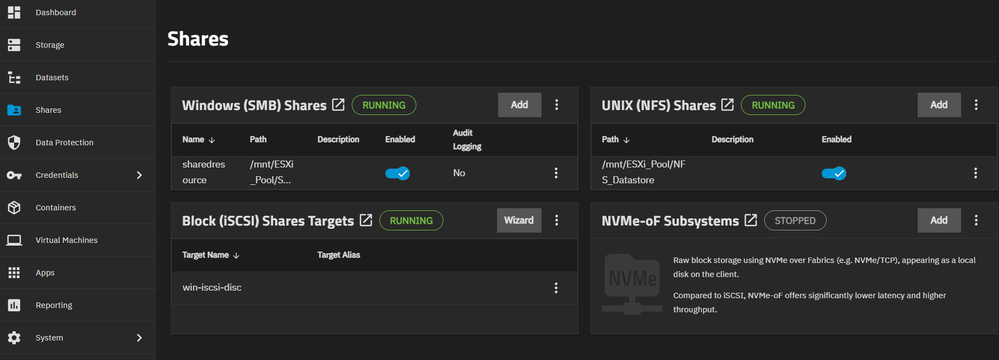
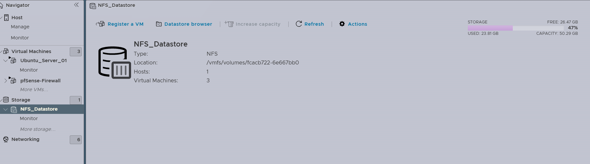
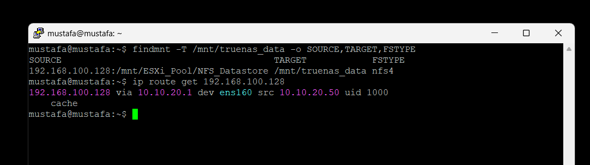

# Storage and ZFS Design: Centralized NFS Storage Fabric

---

## 1. Purpose and Scope

This document describes the **verified final storage architecture** of the Virtualized Enterprise Network Infrastructure homelab.

The final implementation differs from an earlier design iteration in two important ways:

1. **TrueNAS is located on the host-side `192.168.100.0/24` network**, not directly on the Ubuntu server subnet.
2. The TrueNAS NFS export is used by **both nested ESXi and Ubuntu**, making TrueNAS a central infrastructure dependency rather than only an application-data server.

The storage design models separation of compute and storage within a single physical workstation. It is not a high-availability or physically redundant storage architecture.

---

## 2. Verified Storage Topology

```text
Physical Windows Host
        |
        v
VMware Workstation Pro 26H1
        |
        +-----------------------------+
        |                             |
        v                             v
TrueNAS SCALE                   Nested ESXi 7.0.3
192.168.100.128                 192.168.100.129
        |                             |
        | NFS export                  | NFS datastore
        |                             |
        +------ /mnt/ESXi_Pool/NFS_Datastore
                                      |
                                      +-- pfSense-Firewall
                                      +-- Ubuntu_Server_01
                                      +-- Windows-Server-AD

Ubuntu Server
10.10.20.50
ens160
        |
        | route via pfSense 10.10.20.1
        v
192.168.100.128:/mnt/ESXi_Pool/NFS_Datastore
        |
        v
/mnt/truenas_data
        |
        +-- container persistent paths
```

The same TrueNAS export therefore serves two distinct consumers:

- **ESXi**, as `NFS_Datastore`;
- **Ubuntu**, as `/mnt/truenas_data`.

---

## 3. TrueNAS Storage Appliance

TrueNAS runs directly under VMware Workstation rather than inside nested ESXi.

Verified address:

```text
192.168.100.128
```

Observed storage pool:

```text
ESXi_Pool
```

The live TrueNAS storage view showed OpenZFS-backed storage with `lz4` compression enabled.

### Verified storage services

The TrueNAS Shares interface showed the following services active:

- **SMB** — running
- **NFS** — running
- **iSCSI** — running

The primary NFS export used by this project is:

```text
/mnt/ESXi_Pool/NFS_Datastore
```



### Scope boundary

This repository does **not** claim that the lab implements any of the following unless separately demonstrated:

- RAIDZ;
- disk mirroring;
- automated snapshot schedules;
- replication;
- failover;
- dedicated SLOG;
- L2ARC;
- production-grade backup retention.

The environment is intentionally constrained by a single physical workstation.

---

## 4. OpenZFS Role

OpenZFS provides the storage pool and filesystem layer behind the TrueNAS services.

### 4.1 Copy-on-Write semantics

OpenZFS uses Copy-on-Write behavior for filesystem updates. New blocks are written before metadata pointers are updated to reference the new state.

This improves filesystem consistency during interrupted writes, but it does **not** make application-level transactions immune to crashes.

### 4.2 Checksumming

OpenZFS checksums data and metadata during normal operation.

A key distinction is that **checksumming and self-healing are not the same thing**. Self-healing requires a valid redundant copy from which damaged data can be reconstructed. Because physical redundancy was not verified for this lab, this repository does not claim automatic recovery from every corrupted block.

### 4.3 `lz4` compression

`lz4` compression was visible in the live TrueNAS configuration and is therefore treated as verified.

Compression savings depend on workload characteristics; no benchmark or compression-ratio claim is made here.

---

## 5. Dataset and Directory Interpretation

An earlier documentation draft described dedicated ZFS datasets for individual applications such as Nextcloud, Gitea, and Pi-hole.

The final live evidence does **not** support that claim.

The verified TrueNAS dataset/storage view showed entries including:

```text
ESXi_Pool
├── Backups
├── NFS_Datastore
├── SharedResource
└── WinServer_iSCSI_LUN
```

The ESXi datastore browser then showed directories such as:

```text
gitea/
nextcloud/
npm/
pihole/
pfSense-Firewall/
Ubuntu_Server_01/
Windows-Server-AD/
```

These application directories should be interpreted as **directories within the exported datastore unless a separate ZFS dataset is independently verified**.

Therefore, this repository deliberately avoids calling `gitea`, `nextcloud`, `npm`, or `pihole` separate ZFS datasets.

---

## 6. ESXi NFS Datastore

Nested ESXi consumes the TrueNAS export as a datastore named:

```text
NFS_Datastore
```

The live ESXi interface showed:

```text
Type: NFS
Virtual Machines: 3
```



The three project workloads hosted by nested ESXi are:

- `pfSense-Firewall`
- `Ubuntu_Server_01`
- `Windows-Server-AD`

This means TrueNAS storage availability is upstream of the nested VM workload layer.

### Operational consequence

If the TrueNAS NFS service or storage VM becomes unavailable:

- Workstation can remain running;
- the ESXi VM can remain running;
- the ESXi NFS datastore becomes unavailable;
- ESXi-hosted VM disk access is affected;
- Ubuntu's application NFS mount is also affected.

This centralizes storage management but introduces a deliberate single storage dependency.

---

## 7. Ubuntu NFS Client

Final Ubuntu compute-node addressing:

```text
Ubuntu Server 26.04 LTS
IP:        10.10.20.50/24
Interface: ens160
Gateway:   10.10.20.1
```

### Verified mount

The following command was used to inspect the live mount:

```bash
findmnt -T /mnt/truenas_data -o SOURCE,TARGET,FSTYPE
```

Verified output:

```text
SOURCE                                           TARGET              FSTYPE
192.168.100.128:/mnt/ESXi_Pool/NFS_Datastore    /mnt/truenas_data   nfs4
```

### Verified route

The live routing lookup was:

```bash
ip route get 192.168.100.128
```

and returned the effective path:

```text
192.168.100.128 via 10.10.20.1 dev ens160 src 10.10.20.50
```

Therefore the Ubuntu NFS client reaches TrueNAS through pfSense.



---

## 8. Correct Network Path

The verified storage path is:

```text
Ubuntu
10.10.20.50
    |
    | gateway
    v
pfSense
10.10.20.1
    |
    | routed toward 192.168.100.0/24
    v
TrueNAS
192.168.100.128
```

This replaces an earlier project assumption that Ubuntu and TrueNAS were on the same `10.10.20.0/24` subnet.

### Engineering implication

pfSense is part of the Ubuntu-to-TrueNAS storage path.

If pfSense is down while Ubuntu is running, Ubuntu loses routed reachability to the NFS server even though TrueNAS itself may still be operational.

---

## 9. Persistent Mount Configuration

The live mount source and target were verified with `findmnt`.

The exact current contents of `/etc/fstab` were **not independently captured during the final evidence pass**, so the following should be treated as a reconstructed template matching the verified live mount:

```text
# Reconstructed template matching the verified live NFS mount
192.168.100.128:/mnt/ESXi_Pool/NFS_Datastore  /mnt/truenas_data  nfs  defaults,_netdev  0  0
```

### `_netdev`

`_netdev` marks the mount as network-dependent and helps the init system avoid treating the filesystem like a local disk.

It does not guarantee that:

- pfSense is already routing;
- TrueNAS is fully booted;
- the NFS service is ready;
- the export is reachable.

For that reason, operational readiness should still be verified before dependent application stacks start.

---

## 10. Docker Persistence Layer

Docker itself does not create the NFS session in this design.

The abstraction chain is:

```text
Container
    |
    | bind mount
    v
Ubuntu host path
/mnt/truenas_data/...
    |
    | Linux NFS client
    v
TrueNAS export
/mnt/ESXi_Pool/NFS_Datastore
```

Examples of repository-documented host paths include:

```text
/mnt/truenas_data/gitea
/mnt/truenas_data/nextcloud
/mnt/truenas_data/pihole
/mnt/truenas_data/npm
```

The exact container bind paths are documented in the reconstructed Compose artifact:

[`../compose/docker-compose.yml`](../compose/docker-compose.yml)

> **Provenance note:** The repository Compose file is a later consolidated reconstruction. The live environment used separate Portainer Compose stacks.

---

## 11. NFS Permission Incident and Maproot

During the project, container workloads encountered write-permission problems on the TrueNAS-backed storage.

The preserved project history associates the issue with NFS root identity mapping.

### Confirmed lab remediation

The TrueNAS export was configured with:

```text
Maproot User:  root
Maproot Group: root
```

This allowed required root-originated initialization operations to write to the export.

### Security trade-off

This is a **lab-specific compatibility decision**, not a production hardening recommendation.

Mapping remote root to server-side root increases the authority of the client. More restrictive production alternatives can include:

- aligned application UIDs/GIDs;
- per-service datasets/exports;
- ACL-based access;
- dedicated service accounts;
- narrower client/network restrictions.

Those alternatives were not implemented and should not be described as completed work.

---

## 12. Mount-Race Risk

A network mount creates an important boot-order risk.

If Ubuntu starts Docker workloads before `/mnt/truenas_data` is actually mounted, a bind-mounted path such as:

```text
/mnt/truenas_data/gitea
```

could resolve to the ordinary local Ubuntu directory beneath the intended mount point.

That creates a risk of writing data to the Ubuntu VM's local filesystem instead of the TrueNAS export.

### Read-only verification helper

The repository includes:

[`../scripts/nfs-mount-verify.sh`](../scripts/nfs-mount-verify.sh)

This script is a later reconstructed diagnostic helper. It checks:

- mount-point existence;
- active mount status;
- filesystem type (`nfs` / `nfs4`);
- read access;
- active mount details.

It was **not** the original live deployment mechanism.

---

## 13. Startup Dependency

The storage-aware startup sequence is:

```text
1. Physical Windows host
2. VMware Workstation
3. TrueNAS
4. Nested ESXi
5. Confirm NFS_Datastore
6. pfSense
7. Windows Server AD
8. Ubuntu Server
9. Confirm /mnt/truenas_data
10. Docker / Portainer stacks
```

Why this order matters:

- TrueNAS must be available before ESXi relies on its NFS datastore;
- pfSense must be available before Ubuntu can route to `192.168.100.128`;
- Ubuntu's NFS mount should be active before containers bind persistent paths.

### Shutdown dependency

Recommended reverse sequence:

```text
Application workloads
-> Ubuntu / Windows Server
-> pfSense
-> ESXi
-> TrueNAS
```

TrueNAS should be the final storage infrastructure VM shut down.

---

## 14. Failure Scenarios

### 14.1 TrueNAS unavailable

Expected impact:

- ESXi `NFS_Datastore` unavailable;
- nested VM storage affected;
- Ubuntu NFS mount affected;
- container persistence affected.

### 14.2 pfSense unavailable

Expected impact while Ubuntu is running:

- Ubuntu loses its verified routed path to TrueNAS;
- host-side DNAT ingress stops;
- cross-zone routing stops.

### 14.3 Ubuntu unavailable

Expected impact:

- Docker and Portainer stop;
- NPM, Pi-hole, Nextcloud, and Gitea stop;
- TrueNAS and Active Directory can remain independent.

### 14.4 NFS mounted but permissions incorrect

Expected symptom:

- mount appears healthy;
- container initialization or write operations fail.

This requires checking server-side NFS identity/permission configuration rather than only mount reachability.

---

## 15. Verification Commands

### Confirm mounted source

```bash
findmnt -T /mnt/truenas_data -o SOURCE,TARGET,FSTYPE
```

### Confirm route to TrueNAS

```bash
ip route get 192.168.100.128
```

### Confirm mount point

```bash
mountpoint /mnt/truenas_data
```

### Show mount details

```bash
findmnt -o SOURCE,TARGET,FSTYPE,OPTIONS -M /mnt/truenas_data
```

### Basic read test

```bash
ls -la /mnt/truenas_data
```

These commands are diagnostic. Write tests should be performed only when intentionally validating permissions and when test data is safe to create/remove.

---

## 16. Evidence Map

| Storage statement | Evidence |
|---|---|
| TrueNAS exports NFS and also runs SMB/iSCSI | `screenshots/04-truenas-storage-services.png` |
| Export path is `/mnt/ESXi_Pool/NFS_Datastore` | `screenshots/04-truenas-storage-services.png` |
| ESXi consumes NFS datastore | `screenshots/05-esxi-nfs-datastore.png` |
| ESXi datastore has 3 VMs | `screenshots/05-esxi-nfs-datastore.png` |
| Ubuntu mounts the same export | `screenshots/06-ubuntu-nfs-routing.png` |
| Ubuntu routes to TrueNAS via pfSense | `screenshots/06-ubuntu-nfs-routing.png` |

---

## 17. Design Trade-offs

### Advantages

- separates storage administration from application runtime;
- gives ESXi shared network storage;
- allows Ubuntu application paths to live on centralized storage;
- provides practical experience with NFS, ZFS, routing, and dependency ordering;
- makes storage behavior visible across virtualization layers.

### Limitations

- single TrueNAS VM is a storage failure domain;
- single physical workstation is the ultimate failure domain;
- nested virtualization adds latency and complexity;
- routed NFS makes pfSense part of Ubuntu storage reachability;
- Maproot weakens NFS isolation compared with more restrictive identity designs;
- no verified high-availability or physical disk redundancy.

---

## 18. Repository Provenance

| File | Classification |
|---|---|
| `screenshots/04-truenas-storage-services.png` | Verified live evidence |
| `screenshots/05-esxi-nfs-datastore.png` | Verified live evidence |
| `screenshots/06-ubuntu-nfs-routing.png` | Verified live evidence |
| `../scripts/nfs-mount-verify.sh` | Reconstructed read-only helper |
| `../compose/docker-compose.yml` | Reconstructed consolidated Compose |
| `../configs/netplan/50-cloud-init.yaml` | Reconstructed network template |
| `../README.md` | Current architecture summary |

---

## 19. Engineering Lessons

1. **Do not infer dataset structure from directory names.**
2. **Verify live mount sources with `findmnt`, not memory.**
3. **Verify network paths with the routing table.**
4. **Central storage changes both startup and shutdown sequencing.**
5. **NFS reachability and NFS write permissions are different problems.**
6. **A single exported filesystem can serve multiple infrastructure roles.**
7. **Reconstructed configuration should always be labeled as reconstructed.**
8. **Centralization improves manageability but can increase dependency concentration.**

---

## 20. Scope Boundary

This document describes the final verified storage relationships of the homelab.

It does not claim:

- high availability;
- automatic failover;
- RAIDZ or mirrored storage;
- automated snapshots or replication;
- dedicated ZFS datasets for every application;
- production NFS security;
- uninterrupted operation during storage-node failure.
